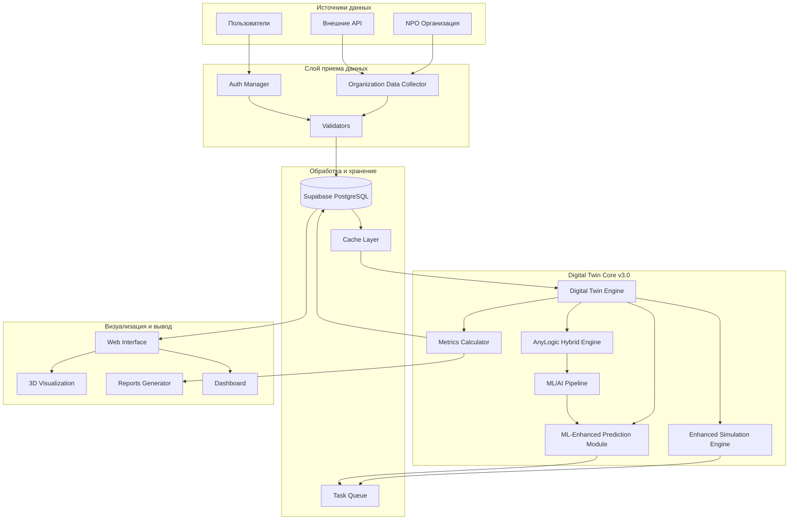
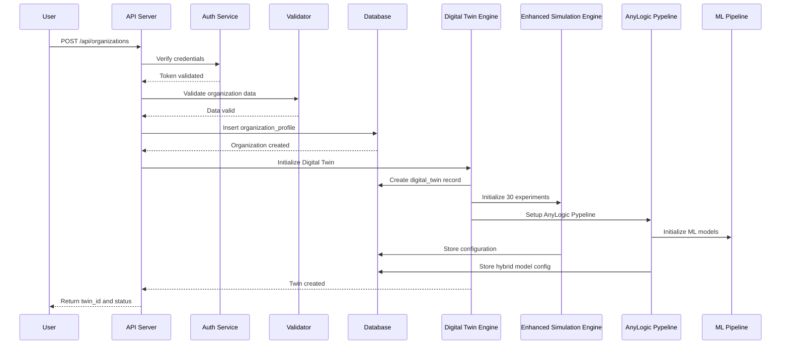
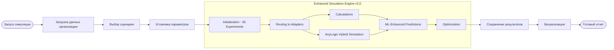
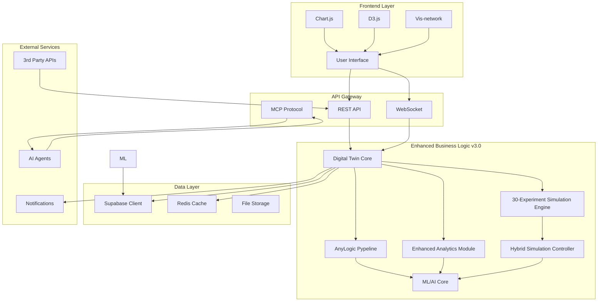
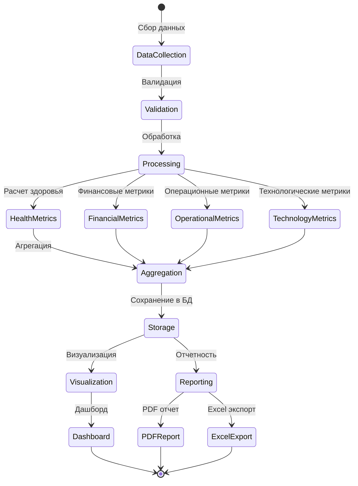
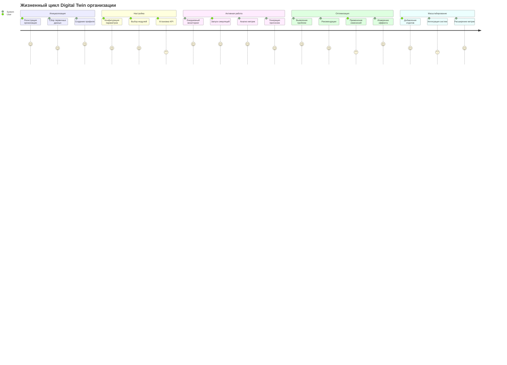
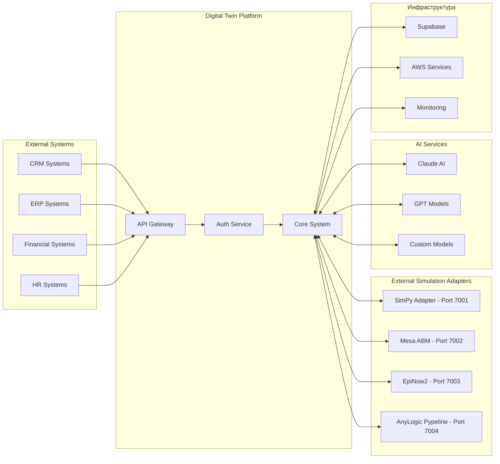
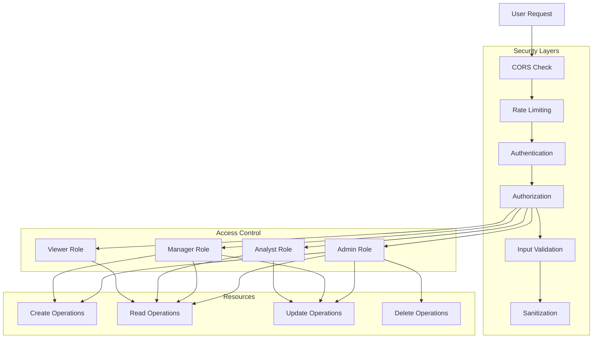

# Digital Twin System v3.0 - System Flow Diagrams and Architecture
## Enhanced with AnyLogic Pypeline Integration

## 1. Основной поток данных системы

## 2. Процесс создания Digital Twin

## 3. Процесс симуляции

## 4. Архитектура компонентов

## 5. Поток метрик и аналитики

## 6. Жизненный цикл Digital Twin

## 7. Интеграционная схема

## 8. Безопасность и права доступа

## Описание потоков

### 1. **Enhanced Data Flow v3.0**
- Data flows from organizations, external APIs, and users
- Validation and authentication processing
- Storage in Supabase PostgreSQL with ML model persistence
- Processing through enhanced Digital Twin engine with 30 experiments
- AnyLogic Pypeline integration for hybrid simulation
- ML/AI enhancement through TensorFlow/PyTorch pipeline
- Advanced visualization in web interface with 3D capabilities

### 2. **Enhanced Digital Twin Creation**
- User registers NPO organization
- System validates data with ML assistance
- Profile created in database with ML model preparation
- Digital twin initialized with 30 experiment capabilities
- AnyLogic Pypeline configured for hybrid simulation
- ML models trained on organization-specific data
- All simulation scenarios configured and validated

### 3. **Enhanced Simulation Process**
- Organization data loaded with ML feature engineering
- Selection from 30 available experiments across 4 categories
- Intelligent routing to appropriate simulation engine
- AnyLogic hybrid simulation with multi-paradigm modeling
- ML-enhanced predictions and optimization
- Advanced result generation with confidence scoring
- Results stored with ML model updates and visualized in 3D

### 4. **ML-Enhanced Metrics and Analytics**
- Continuous data collection with ML pattern recognition
- Calculation of 4 metric categories enhanced by AI predictions
- Advanced aggregation with statistical learning
- Real-time visualization with predictive insights
- Automated report generation with ML-driven recommendations
- Continuous model improvement through feedback loops

---
*Диаграммы созданы с использованием Mermaid синтаксиса и могут быть отрендерены в любом Markdown viewer с поддержкой Mermaid*