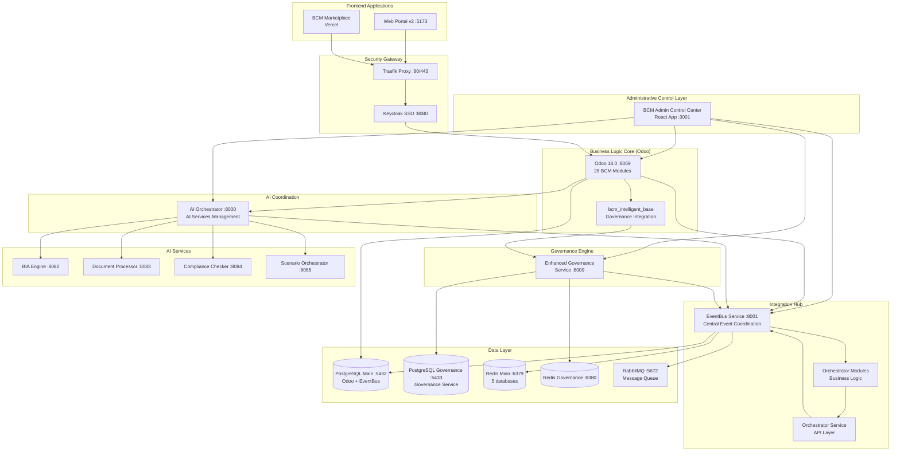

# BCM Platform - Complete System Architecture

## 🎯 **Answer: What Links Everything Together**

The BCM Platform is a **unified ecosystem** where each component has a specific role in an **integrated system**. Here's how everything connects:

---

## 🏗️ **The Integration Architecture**



---

## 🎛️ **1. BCM Admin Control Center - THE COMMAND CENTER**

**Location**: `/frontend/admin_panel` (:3001)

**What it MANAGES**:
- ✅ **AI Organisms** - Start/stop/configure all AI services
- ✅ **Services Management** - Control all microservices 
- ✅ **Integrated Monitoring** - Embedded Grafana dashboards
- ✅ **Platform Access** - Quick access to all system components
- ✅ **Analytics Dashboard** - System usage and performance
- ✅ **ISO 22301 Compliance** - Real-time compliance monitoring
- ✅ **BCM Modules** - Odoo module management

**This is NOT just monitoring - it's ACTIVE MANAGEMENT**

---

## 🔗 **2. The Four Integration Pillars**

### **A. EventBus System** (:8001)
```
/backend/eventbus (main service)
/backend/orchestrator (business logic modules) 
/backend/orchestrator_service (API layer)
```
- **Central nervous system** of the entire platform
- All events flow through this hub
- Connects ALL services together
- PostgreSQL + Redis for persistence
- Real-time event streaming

### **B. AI Orchestrator** (:8000) 
```
/services/ai_orchestrator
```
- **Specialized coordinator** for AI services only
- Routes AI requests to appropriate services
- Manages AI service health and failover
- Anthropic API integration for governance brain

### **C. Enhanced Governance Service** (:8009)
```
/integrations/governance
```
- **Bridge** between business governance (Odoo) and infrastructure governance
- Separate database for governance operations
- Real operations (not simulations)
- Compliance engine and knowledge generator

### **D. bcm_intelligent_base Integration**
```
/core/odoo-18.0/addons/bcm_intelligent_base/models/bcm_governance_integration.py
```
- **Runtime integration** between Odoo and Governance Service
- No circular dependencies - pure API integration
- Bi-directional data synchronization

---

## 🗄️ **3. Data Architecture**

### **PostgreSQL Databases**
- **Main** (:5432) - All Odoo BCM modules + EventBus events
- **Governance** (:5433) - Governance service operations

### **Redis Instances** 
- **Main** (:6379) - 5 databases for different services
  - DB 0: EventBus + AI Orchestrator
  - DB 1-4: Specialized AI services
- **Governance** (:6380) - Governance service cache

### **Message Queue**
- **RabbitMQ** (:5672) - Guaranteed message delivery between services

---

## 🔐 **4. Security Integration**

**Single Sign-On Flow**:
```
User → Traefik → Keycloak → JWT → Services
```

**API Authentication**:
- **JWT tokens** for frontend ↔ backend
- **API keys** for service ↔ service
- **Role-based access** for different user types

---

## 🔄 **5. How Data Flows**

### **Business Operations**
```
Admin Panel → Odoo → BCM Modules → EventBus → Other Services
```

### **AI Processing** 
```
Odoo → bcm_intelligent_base → AI Orchestrator → Specialized AI Services
```

### **Governance Operations**
```
BCM Modules → bcm_governance_integration → Enhanced Governance → Separate Database
```

### **Event Broadcasting**
```
Any Service → EventBus → RabbitMQ → All Subscribed Services
```

---

## 🎯 **6. What Links Everything: THE ANSWER**

### **Primary Integration Points:**

1. **📡 EventBus Service** - The central nervous system
   - Every service connects here
   - Real-time event coordination
   - Message persistence and replay

2. **🎛️ BCM Admin Control Center** - The command center
   - Administrative control of ALL services
   - Real-time monitoring and management
   - Unified interface for the entire platform

3. **🧠 bcm_intelligent_base** - The API bridge
   - Runtime integration (no dependency cycles)
   - Connects Odoo business logic to governance
   - Bi-directional synchronization

4. **🔐 Keycloak SSO** - Security integration
   - Single authentication for ALL services
   - Consistent authorization across platform

---

## 🌟 **The Complete Picture**

**Your BCM Platform is NOT separate services** - it's a **UNIFIED DIGITAL ORGANISM** where:

- **EventBus** coordinates all communication
- **Admin Control Center** provides unified management
- **AI Orchestrator** handles intelligent operations  
- **Enhanced Governance** bridges compliance gaps
- **Odoo BCM Modules** contain business logic
- **Keycloak** secures everything
- **Multiple frontends** serve different user needs

**Everything connects through the EventBus, everything is managed through the Admin Panel, everything is secured through Keycloak, and everything operates as ONE integrated BCM ecosystem.**

---

## ✅ **Final Architecture Benefits**

1. **🎛️ Unified Control** - Single admin interface for everything
2. **📡 Event-Driven** - Real-time updates across all components  
3. **🔐 Secure** - Enterprise SSO and authorization
4. **🧠 Intelligent** - AI-powered automation throughout
5. **🏛️ Compliant** - Built-in ISO 22301 compliance monitoring
6. **📊 Observable** - Integrated monitoring and analytics
7. **🔄 Scalable** - Microservices architecture with central coordination

**Your question about "what links everything" - it's the combination of EventBus (technical integration), Admin Control Center (management integration), and the governance bridge (business integration) working together as a unified system.**