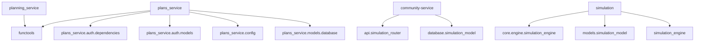

# platform-services - Architecture Overview

> Архитектура и структура слоя platform-services

## 📊 Статистика слоя

| Метрика | Значение |
|---------|----------|
| **Модулей** | 19 |
| **Всего endpoints** | 735 |
| **Всего классов** | 1412 |
| **Всего LOC** | 162,537 |

**Последнее обновление:** 2025-10-07

---

## 🏗️ Модули

| Модуль | Тип | LOC | Endpoints | Классов |
|--------|-----|-----|-----------|--------|
| [bia-service](./bia-service/README.md) | 🌐 API Service | 6,919 | 31 | 77 |
| [community-service](./community-service/README.md) | 🌐 API Service | 18,334 | 100 | 170 |
| [compliance-service](./compliance-service/README.md) | 🌐 API Service | 17,481 | 97 | 136 |
| [docs](./docs/README.md) | 🔧 Utility Module | 560 | 0 | 0 |
| [documents-service](./documents-service/README.md) | 🌐 API Service | 10,132 | 30 | 71 |
| [governance-service](./governance-service/README.md) | 🌐 API Service | 7,225 | 46 | 90 |
| [integration-tests](./integration-tests/README.md) | 🔧 Utility Module | 4,441 | 0 | 1 |
| [learning-service](./learning-service/README.md) | 🌐 API Service | 6,268 | 34 | 83 |
| [living-docs](./living-docs/README.md) | 🌐 API Service | 3,255 | 10 | 24 |
| [monitoring](./monitoring/README.md) | 🔧 Utility Module | 0 | 0 | 0 |
| [performance-tests](./performance-tests/README.md) | 📚 Library | 4,248 | 0 | 12 |
| [planning_service](./planning_service/README.md) | 🌐 API Service | 6,197 | 22 | 50 |
| [plans_service](./plans_service/README.md) | 🌐 API Service | 8,609 | 34 | 79 |
| [response-service](./response-service/README.md) | 🌐 API Service | 10,708 | 18 | 80 |
| [risk-service](./risk-service/README.md) | 🌐 API Service | 6,127 | 30 | 48 |
| [scripts](./scripts/README.md) | 🔧 Utility Module | 0 | 0 | 0 |
| [simulation](./simulation/README.md) | 🌐 API Service | 44,465 | 233 | 382 |
| [tools](./tools/README.md) | 🔧 Utility Module | 0 | 0 | 0 |
| [validation-service](./validation-service/README.md) | 🌐 API Service | 7,568 | 50 | 109 |

---

## 🔗 Граф зависимостей

---

## 📦 Детальное описание модулей

### bia-service

🌐 API Service модуль платформы

**Ключевые классы:**
- `TestBIAProcessModel` (14 методов)
- `TestRecoveryObjectivesValidation` (5 методов)
- `TestWorkaroundCapacityValidation` (3 методов)

[→ Полная документация](./bia-service/README.md)

---

### community-service

🌐 API Service модуль платформы

**Ключевые классы:**
- `MonteCarloEngine` (4 методов)
- `BaseSimulationEngine` (3 методов)
- `KnowledgeService` (3 методов)

[→ Полная документация](./community-service/README.md)

---

### compliance-service

🌐 API Service модуль платформы

**Ключевые классы:**
- `TestWorkflowValidators` (24 методов)
- `WorkflowValidator` (11 методов)
- `BaseWorkflow` (11 методов)

[→ Полная документация](./compliance-service/README.md)

---

### docs

🔧 Utility Module модуль платформы

[→ Полная документация](./docs/README.md)

---

### documents-service

🌐 API Service модуль платформы

**Ключевые классы:**
- `DocumentAnalyzer` (10 методов)
- `DocumentClassifier` (8 методов)
- `DocumentComparator` (8 методов)

[→ Полная документация](./documents-service/README.md)

---

### governance-service

🌐 API Service модуль платформы

**Ключевые классы:**
- `PolicyWorkflowEngine` (8 методов)
- `PolicyValidator` (5 методов)
- `ResourceValidator` (5 методов)

[→ Полная документация](./governance-service/README.md)

---

### integration-tests

🔧 Utility Module модуль платформы

**Ключевые классы:**
- `EventBusHelper` (1 методов)

[→ Полная документация](./integration-tests/README.md)

---

### learning-service

🌐 API Service модуль платформы

**Ключевые классы:**
- `WorkflowSecurityMiddleware` (1 методов)
- `TrainingProgram` (1 методов)
- `TrainingEnrollment` (1 методов)

[→ Полная документация](./learning-service/README.md)

---

### living-docs

🌐 API Service модуль платформы

**Ключевые классы:**
- `AIExampleGenerator` (8 методов)
- `DocumentationEvolutionEngine` (6 методов)
- `InteractiveExampleRunner` (3 методов)

[→ Полная документация](./living-docs/README.md)

---

### monitoring

🔧 Utility Module модуль платформы

[→ Полная документация](./monitoring/README.md)

---

### performance-tests

📚 Library модуль платформы

**Ключевые классы:**
- `HeavyLoadUser` (16 методов)
- `MediumLoadUser` (14 методов)
- `StressTestUser` (13 методов)

[→ Полная документация](./performance-tests/README.md)

---

### planning_service

🌐 API Service модуль платформы

**Ключевые классы:**
- `TestCostBenefitRequestValidation` (11 методов)
- `TestCostBreakdownValidation` (8 методов)
- `TestBenefitAnalysisValidation` (8 методов)

[→ Полная документация](./planning_service/README.md)

---

### plans_service

🌐 API Service модуль платформы

**Ключевые классы:**
- `TestPlanWorkflow` (23 методов)
- `TestProcedureDependencyValidator` (19 методов)
- `TestPlanValidation` (12 методов)

[→ Полная документация](./plans_service/README.md)

---

### response-service

🌐 API Service модуль платформы

**Ключевые классы:**
- `TestIncidentEndpoints` (9 методов)
- `ResponseRepository` (8 методов)
- `Settings` (4 методов)

[→ Полная документация](./response-service/README.md)

---

### risk-service

🌐 API Service модуль платформы

**Ключевые классы:**
- `RiskService` (7 методов)
- `TestUserCreation` (6 методов)
- `TestJWTVerification` (5 методов)

[→ Полная документация](./risk-service/README.md)

---

### scripts

🔧 Utility Module модуль платформы

[→ Полная документация](./scripts/README.md)

---

### simulation

🌐 API Service модуль платформы

**Ключевые классы:**
- `BCMIncidentUnified` (47 методов)
- `TheHiveClient` (14 методов)
- `BCMIncidentMigration` (14 методов)

[→ Полная документация](./simulation/README.md)

---

### tools

🔧 Utility Module модуль платформы

[→ Полная документация](./tools/README.md)

---

### validation-service

🌐 API Service модуль платформы

**Ключевые классы:**
- `KPIService` (3 методов)
- `WorkflowSecurityMiddleware` (1 методов)
- `ValidationRepository` (1 методов)

[→ Полная документация](./validation-service/README.md)

---

## 🎯 Roadmap

- [ ] Полное покрытие тестами (>80%)
- [ ] API документация (OpenAPI/Swagger)
- [ ] Performance мониторинг
- [ ] CI/CD интеграция

---

**Сгенерировано:** 2025-10-07 05:08
**Инструмент:** `tools/generators/documentation_generator.py`
