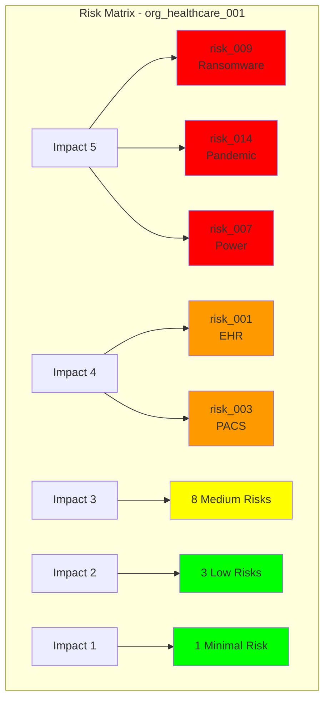
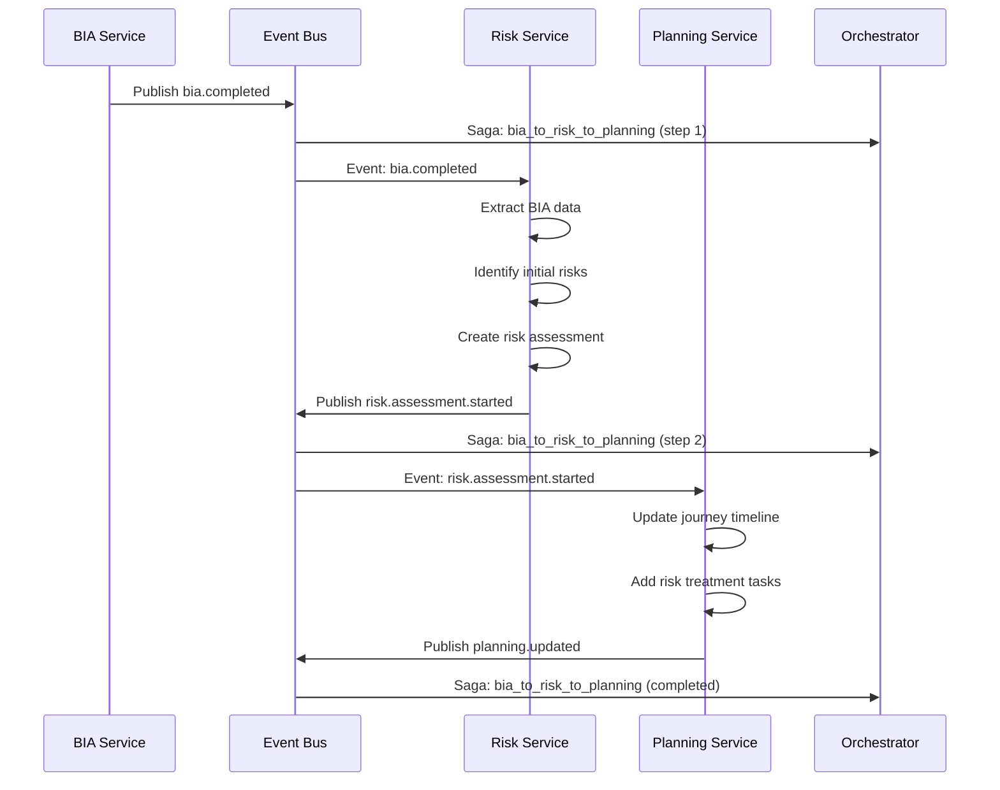
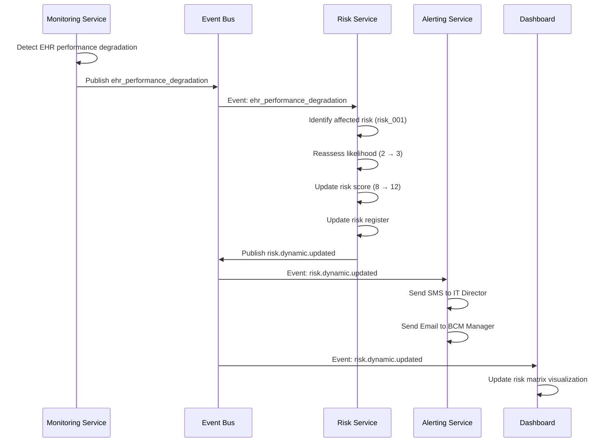

# Risk Service - Detailed Scenarios with Examples
## Risk Assessment & Treatment - Complete Usage Scenarios

**Service**: Risk Service (Port 8040)
**ISO Clause**: 8.2.3 - Risk Assessment and Treatment
**Total Scenarios**: 22
**Status**: ✅ Ready for Implementation

---

## Table of Contents

1. [Core Risk Assessment (1-10)](#core-risk-assessment)
2. [Advanced Risk Scenarios (11-22)](#advanced-risk-scenarios)
3. [API Reference](#api-reference)
4. [Event Flow Diagrams](#event-flow-diagrams)

---

## Core Risk Assessment

### 2.1 Start Risk Assessment (from BIA)

**Business Context**: After completing BIA, organization automatically begins risk assessment to identify threats to critical processes and dependencies

**Inputs**:
```json
{
  "bia_id": "bia_2025_001",
  "organization_id": "org_healthcare_001",
  "trigger": "bia.completed",
  "scope": {
    "critical_processes": 12,
    "key_dependencies": ["EHR", "PACS", "Laboratory", "Pharmacy"],
    "rto_requirements": "15min to 24hrs"
  },
  "assessment_approach": "hybrid",
  "lead_contact": {
    "name": "Dr. Sarah Johnson",
    "email": "sarah.johnson@hospital.com",
    "role": "BCM Manager"
  }
}
```

**API Endpoint**: `POST /api/risk/start`

**Process Flow (Saga Pattern)**:
```
BIA Service: bia.completed event
  ↓
Event Bus: Saga orchestration
  ↓
Risk Service:
  1. Listen for bia.completed event
  2. Extract critical processes + dependencies from BIA
  3. Create risk assessment project
  4. Initialize risk register (PostgreSQL)
  5. Trigger AI risk identification
  6. Send notification to BCM Manager
  ↓
Return: risk_assessment_id, workflow_url, identified_risks
```

**Response**:
```json
{
  "risk_assessment_id": "risk_2025_001",
  "bia_id": "bia_2025_001",
  "status": "initialized",
  "workflow_url": "/api/risk/risk_2025_001/workflow",
  "initial_risks_identified": {
    "count": 18,
    "sources": [
      "BIA critical process disruptions",
      "Technology dependency failures",
      "Staff unavailability",
      "External service disruptions"
    ]
  },
  "risk_categories": {
    "technology": 8,
    "people": 4,
    "process": 3,
    "external": 3
  },
  "next_steps": [
    {
      "step": 1,
      "action": "review_ai_identified_risks",
      "url": "/api/risk/risk_2025_001/risks",
      "due_date": "2025-10-15"
    },
    {
      "step": 2,
      "action": "conduct_likelihood_assessment",
      "url": "/api/risk/risk_2025_001/likelihood",
      "due_date": "2025-10-20"
    },
    {
      "step": 3,
      "action": "conduct_impact_analysis",
      "url": "/api/risk/risk_2025_001/impact",
      "due_date": "2025-10-22"
    }
  ],
  "estimated_duration_days": 21,
  "created_at": "2025-10-10T22:00:00Z"
}
```

**Events Published**:
```yaml
- event: risk.assessment.started
  payload:
    risk_assessment_id: risk_2025_001
    bia_id: bia_2025_001
    organization_id: org_healthcare_001
    risks_identified: 18
  subscribers:
    - orchestrator (track progress)
    - planning-service (update journey timeline)
    - notification-service (notify stakeholders)

- event: saga.risk_assessment.initiated
  saga_pattern: bia_to_risk_to_planning
  step: 2_of_3
  compensation: rollback_risk_assessment_if_failed
```

**Components Used**:
- Risk Service (main)
- BIA Service (data source)
- Event Bus (Saga pattern)
- Orchestrator (workflow coordination)
- AI Foundation (RAG - threat libraries)
- PostgreSQL (risk register storage)
- Notification Service

**Success Criteria**:
- ✅ Risk assessment created with unique ID
- ✅ BIA data successfully extracted (critical processes, dependencies)
- ✅ Initial risks identified from BIA
- ✅ Workflow initialized in orchestrator
- ✅ BCM Manager notified with next steps

**Error Handling**:
```json
{
  "error": "BIANotCompleteError",
  "message": "Cannot start risk assessment - BIA 'bia_2025_001' is not complete",
  "bia_status": "in_progress",
  "bia_completion": "65%",
  "action": "Complete BIA first or wait for BIA completion"
}
```

**Business Value**:
- **Automated Flow**: Seamless transition from BIA to Risk Assessment (no manual handoff)
- **AI-Powered**: Initial risk identification from BIA data
- **ISO Compliance**: Aligns with ISO 22301 Clause 8.2.3 requirement
- **Time Savings**: Reduces risk identification from 5 days to 2 hours

---

### 2.2 ML-Powered Risk Likelihood Prediction

**Business Context**: For each identified risk, system predicts likelihood using FAIR methodology (Loss Event Frequency), Monte Carlo simulation, and historical data

**Inputs**:
```json
{
  "risk_assessment_id": "risk_2025_001",
  "risk": {
    "id": "risk_001",
    "title": "EHR System Failure",
    "description": "Electronic Health Record system becomes unavailable due to software failure, hardware failure, or cyber attack",
    "category": "technology",
    "affected_processes": [
      "Patient Triage (RTO: 15 min)",
      "Treatment Documentation (RTO: 1 hour)",
      "Medication Orders (RTO: 30 min)"
    ]
  },
  "organization_profile": {
    "industry": "healthcare",
    "size": "500_employees",
    "ehr_system": "EPIC",
    "it_maturity": "medium",
    "redundancy": "warm_standby_4_hour_rto"
  },
  "historical_data": {
    "past_incidents": [
      {
        "date": "2024-03-15",
        "type": "ehr_outage",
        "duration": "2 hours",
        "cause": "software_patch_failure"
      },
      {
        "date": "2023-11-22",
        "type": "ehr_slowness",
        "duration": "6 hours",
        "cause": "database_performance"
      }
    ]
  }
}
```

**API Endpoint**: `POST /api/risk/{risk_assessment_id}/likelihood/predict`

**AI/ML Analysis Process (FAIR Methodology)**:
```
1. Loss Event Frequency (LEF) Analysis
   ├─ Threat Event Frequency (TEF)
   │  ├─ RAG: Query threat libraries for EHR failures
   │  ├─ Collective Intelligence: Similar healthcare orgs (k=5)
   │  └─ Result: 3.2 events/year (industry average for EPIC)
   │
   ├─ Vulnerability (VULN)
   │  ├─ Assess: IT maturity (medium)
   │  ├─ Assess: Redundancy (warm standby = 4hr RTO)
   │  ├─ Assess: Patch management (from monitoring data)
   │  └─ Result: 0.65 (65% vulnerable when threat occurs)
   │
   └─ LEF = TEF × VULN = 3.2 × 0.65 = 2.08 events/year

2. Monte Carlo Simulation (10,000 iterations)
   ├─ Input distributions:
   │  ├─ TEF: Normal(mean=3.2, std=0.8)
   │  ├─ VULN: Beta(alpha=6.5, beta=3.5) # 65% mean
   │  └─ Duration: LogNormal(mean=3hrs, std=2hrs)
   │
   ├─ Simulate: 10,000 scenarios
   └─ Output: Probability distribution of LEF

3. Historical Data Weighting
   ├─ Organization history: 2 incidents in 2 years = 1.0/year
   ├─ Industry data: 3.2/year
   ├─ Weight: 30% org history + 70% industry = 1.96/year
   └─ Confidence adjustment based on data quality

4. ML Model (Random Forest)
   ├─ Features: industry, org_size, it_maturity, system_type, redundancy
   ├─ Training data: 1,200+ historical risk assessments
   └─ Prediction: Likelihood score + confidence
```

**Response**:
```json
{
  "risk_id": "risk_001",
  "risk_title": "EHR System Failure",
  "likelihood_analysis": {
    "fair_methodology": {
      "threat_event_frequency": {
        "value": 3.2,
        "unit": "events_per_year",
        "source": "Industry data (healthcare EPIC systems)",
        "confidence": 0.85
      },
      "vulnerability": {
        "score": 0.65,
        "factors": [
          "Medium IT maturity (-0.15)",
          "Warm standby exists (+0.20)",
          "Patch management inconsistent (-0.10)",
          "No automated failover (-0.25)"
        ],
        "interpretation": "65% chance threat will succeed when it occurs"
      },
      "loss_event_frequency": {
        "value": 2.08,
        "unit": "events_per_year",
        "calculation": "TEF (3.2) × VULN (0.65)",
        "interpretation": "Expected to occur ~2 times per year"
      }
    },
    "monte_carlo_simulation": {
      "iterations": 10000,
      "results": {
        "mean_lef": 2.12,
        "median_lef": 1.95,
        "percentile_90": 3.45,
        "percentile_95": 4.12,
        "percentile_99": 5.67
      },
      "probability_distribution": {
        "0_to_1_per_year": "15%",
        "1_to_2_per_year": "35%",
        "2_to_3_per_year": "30%",
        "3_to_5_per_year": "15%",
        "5_plus_per_year": "5%"
      },
      "confidence_interval_95": {
        "lower": 1.2,
        "upper": 3.8
      }
    },
    "historical_data_weighting": {
      "organization_history": {
        "incidents": 2,
        "timeframe": "2 years",
        "frequency": 1.0,
        "weight": 0.30
      },
      "industry_data": {
        "frequency": 3.2,
        "weight": 0.70
      },
      "weighted_average": 1.96,
      "rationale": "Org has better-than-industry performance, but small sample size"
    },
    "ml_model_prediction": {
      "model": "Random Forest (1,200 training cases)",
      "predicted_likelihood": 2.15,
      "confidence": 0.82,
      "feature_importance": {
        "ehr_system_type": 0.28,
        "redundancy_setup": 0.24,
        "it_maturity": 0.19,
        "org_size": 0.15,
        "industry": 0.14
      }
    },
    "final_likelihood_assessment": {
      "score": 2.1,
      "unit": "events_per_year",
      "likelihood_category": "Likely",
      "iso_likelihood_scale": {
        "1_rare": "< 0.5/year",
        "2_unlikely": "0.5-1/year",
        "3_possible": "1-2/year",
        "4_likely": "2-5/year",
        "5_almost_certain": "> 5/year"
      },
      "assigned_level": 4,
      "confidence": 0.83,
      "methodology": "Weighted average of FAIR (2.08), Monte Carlo (2.12), Historical (1.96), ML (2.15)"
    }
  },
  "contributing_factors": [
    {
      "factor": "Complex EPIC deployment",
      "impact": "increases_likelihood",
      "weight": "high",
      "mitigation": "Simplify customizations, improve testing"
    },
    {
      "factor": "Warm standby exists",
      "impact": "decreases_likelihood",
      "weight": "medium",
      "note": "But 4-hour RTO exceeds critical process needs (15min)"
    },
    {
      "factor": "Healthcare industry dependency on EHR",
      "impact": "increases_impact",
      "weight": "critical",
      "note": "Cannot operate without EHR - paper workarounds limited"
    },
    {
      "factor": "2 incidents in past 2 years",
      "impact": "validates_prediction",
      "weight": "medium",
      "trend": "stable (not worsening)"
    }
  ],
  "recommendations": [
    {
      "priority": "high",
      "recommendation": "Upgrade to hot standby (< 15 min RTO) to match critical process requirements",
      "estimated_cost": "$50,000 - $100,000",
      "likelihood_reduction": "From 2.1 to 1.2 events/year (43% reduction)"
    },
    {
      "priority": "medium",
      "recommendation": "Implement automated failover testing (quarterly)",
      "estimated_cost": "$5,000/year",
      "likelihood_reduction": "From 2.1 to 1.8 events/year (14% reduction)"
    },
    {
      "priority": "medium",
      "recommendation": "Enhance patch management process with staging environment",
      "estimated_cost": "$15,000 setup + $3,000/year",
      "likelihood_reduction": "From 2.1 to 1.9 events/year (10% reduction)"
    }
  ],
  "next_steps": [
    "Conduct impact analysis (Scenario 2.3) to determine financial/operational impact",
    "Review recommendations with IT leadership",
    "Prioritize treatment options (Scenario 2.5)"
  ]
}
```

**Events Published**:
```yaml
- event: risk.likelihood.predicted
  payload:
    risk_id: risk_001
    likelihood_score: 2.1
    likelihood_category: Likely
    confidence: 0.83
    methodology: FAIR + Monte Carlo + ML
  subscribers:
    - risk-service (update risk register)
    - planning-service (treatment planning)
    - dashboard (update risk matrix)
```

**Components Used**:
- Risk Service
- Predictive Engine (Random Forest ML model)
- AI Foundation (RAG for threat intelligence)
- Collective Intelligence (similar org search, k=5 anonymized)
- Simulation Engine (Monte Carlo)
- PostgreSQL (historical data)

**Business Value**:
- **Scientific Rigor**: FAIR methodology is industry-standard for risk quantification
- **Confidence**: Monte Carlo provides probability distribution, not single point estimate
- **Accuracy**: Combines 4 methods (FAIR, Monte Carlo, Historical, ML) for 83% confidence
- **Actionable**: Recommendations show ROI of risk treatments
- **Benchmarking**: Collective Intelligence shows how similar orgs performed

**Calculation Time**: 8-12 seconds per risk

---

### 2.3 Risk Impact Analysis

**Business Context**: For each risk, system calculates multi-dimensional impact (financial, operational, regulatory, reputational) based on BIA data and industry benchmarks

**Inputs**:
```json
{
  "risk_assessment_id": "risk_2025_001",
  "risk_id": "risk_001",
  "risk": "EHR System Failure",
  "likelihood": 2.1,
  "affected_processes": [
    {
      "process": "Patient Triage",
      "bia_data": {
        "rto": "15 minutes",
        "patient_volume": "150-200/day",
        "financial_impact_hourly": "$15,000"
      }
    },
    {
      "process": "Treatment Documentation",
      "bia_data": {
        "rto": "1 hour",
        "patient_volume": "150-200/day",
        "financial_impact_hourly": "$8,000"
      }
    },
    {
      "process": "Medication Orders",
      "bia_data": {
        "rto": "30 minutes",
        "patient_volume": "100-150/day",
        "financial_impact_hourly": "$12,000"
      }
    }
  ],
  "organization_data": {
    "annual_revenue": "$75,000,000",
    "regulatory_requirements": ["HIPAA", "EMTALA", "Joint Commission"],
    "reputation_value": "High (regional medical center)",
    "insurance_coverage": {
      "cyber_insurance": "$5,000,000",
      "business_interruption": "$10,000,000"
    }
  }
}
```

**API Endpoint**: `POST /api/risk/{risk_assessment_id}/impact/analyze`

**Impact Calculation Process**:
```
1. Financial Impact (Loss Magnitude)
   ├─ Direct Revenue Loss
   │  ├─ Hourly impact: $15,000 + $8,000 + $12,000 = $35,000/hour
   │  ├─ Expected downtime: 3 hours (from FAIR analysis)
   │  └─ Per-incident loss: $105,000
   │
   ├─ Indirect Costs
   │  ├─ Staff overtime (recovery): $5,000
   │  ├─ IT emergency response: $8,000
   │  ├─ Patient diversions (ambulance redirects): $10,000
   │  └─ Per-incident indirect: $23,000
   │
   ├─ Regulatory Penalties (Potential)
   │  ├─ HIPAA violation (if PHI compromised): $0 - $50,000
   │  ├─ EMTALA violation (if patients turned away): $0 - $100,000
   │  └─ Expected penalty: $15,000 (probability-weighted)
   │
   └─ Total Financial Impact per Incident: $143,000

2. Annual Loss Expectancy (ALE)
   ├─ ALE = LEF × Loss Magnitude
   ├─ ALE = 2.1 events/year × $143,000
   └─ ALE = $300,300/year

3. Operational Impact
   ├─ Patient Care Disruption: CRITICAL
   ├─ Staff Productivity Loss: 500 employees × 3 hours × $40/hour = $60,000
   ├─ Recovery Effort: 10 people × 8 hours × $60/hour = $4,800
   └─ Process Disruption Score: 9/10 (severe)

4. Regulatory Impact
   ├─ EMTALA: "Must stabilize emergency patients" - HIGH RISK
   ├─ HIPAA: "Availability requirement" - MEDIUM RISK
   ├─ Joint Commission: "Emergency preparedness" - MEDIUM RISK
   └─ Regulatory Risk Score: 8/10

5. Reputational Impact
   ├─ Media attention probability: 40% (regional hospital)
   ├─ Patient trust impact: HIGH (cannot provide care)
   ├─ Competitor advantage: MEDIUM (patients may switch)
   ├─ Social media sentiment: NEGATIVE (expected)
   └─ Reputation Score: 7/10

6. Monte Carlo Simulation (Impact Distribution)
   ├─ Simulate: 10,000 scenarios with varying durations
   ├─ Duration distribution: LogNormal(mean=3hr, std=2hr)
   └─ Output: Impact probability distribution
```

**Response**:
```json
{
  "risk_id": "risk_001",
  "risk_title": "EHR System Failure",
  "impact_analysis": {
    "financial_impact": {
      "single_incident": {
        "direct_revenue_loss": {
          "hourly_rate": 35000,
          "expected_duration_hours": 3,
          "total": 105000
        },
        "indirect_costs": {
          "staff_overtime": 5000,
          "it_emergency_response": 8000,
          "patient_diversions": 10000,
          "total": 23000
        },
        "regulatory_penalties": {
          "potential_range": "0 - 150,000",
          "expected_value": 15000,
          "probability_weighted": true
        },
        "total_per_incident": 143000
      },
      "annual_loss_expectancy": {
        "calculation": "LEF (2.1) × Loss Magnitude ($143,000)",
        "ale": 300300,
        "percentile_90": 425000,
        "percentile_95": 520000,
        "percentile_99": 715000,
        "interpretation": "95% confident loss will be under $520,000/year"
      },
      "insurance_coverage": {
        "business_interruption_coverage": 10000000,
        "cyber_insurance_coverage": 5000000,
        "covered_percentage": "100% (well within limits)",
        "deductible": 25000,
        "net_financial_impact": 275300
      },
      "financial_impact_category": "Major",
      "financial_impact_scale": {
        "1_minimal": "< $10,000",
        "2_minor": "$10,000 - $50,000",
        "3_moderate": "$50,000 - $150,000",
        "4_major": "$150,000 - $500,000",
        "5_catastrophic": "> $500,000"
      },
      "assigned_level": 4
    },
    "operational_impact": {
      "affected_processes": 3,
      "critical_processes_affected": 3,
      "patient_care_disruption": {
        "severity": "CRITICAL",
        "patients_affected_per_incident": "150-200",
        "care_delay_average": "3 hours",
        "patient_safety_risk": "HIGH (cannot access medical records)"
      },
      "staff_productivity": {
        "employees_affected": 500,
        "productivity_loss_hours": 3,
        "estimated_cost": 60000
      },
      "recovery_effort": {
        "personnel_required": 10,
        "estimated_hours": 8,
        "estimated_cost": 4800
      },
      "process_disruption_score": 9,
      "operational_impact_category": "Severe",
      "assigned_level": 5
    },
    "regulatory_impact": {
      "emtala_compliance": {
        "requirement": "Stabilize emergency patients regardless of payment ability",
        "risk": "HIGH - Cannot access patient history, allergies, medications",
        "potential_violation": "If patients turned away or care delayed",
        "penalty_range": "$0 - $100,000 per violation"
      },
      "hipaa_compliance": {
        "requirement": "Availability of ePHI (Electronic Protected Health Information)",
        "risk": "MEDIUM - Downtime impacts availability, but not confidentiality/integrity",
        "potential_violation": "If downtime exceeds reasonable limits",
        "penalty_range": "$0 - $50,000"
      },
      "joint_commission": {
        "requirement": "Emergency preparedness and continuity of care",
        "risk": "MEDIUM - Demonstrates gap in preparedness",
        "impact": "Potential survey finding, not immediate penalty",
        "remediation_required": true
      },
      "regulatory_risk_score": 8,
      "regulatory_impact_category": "High",
      "assigned_level": 4
    },
    "reputational_impact": {
      "media_attention": {
        "probability": 0.40,
        "rationale": "Regional hospital, significant patient impact, newsworthy",
        "potential_headlines": [
          "Hospital EHR failure forces patient diversions",
          "Medical center unable to access patient records for 3 hours"
        ]
      },
      "patient_trust": {
        "impact": "HIGH",
        "concern": "Cannot provide care without access to medical history",
        "long_term_effect": "Patient attrition to competitors"
      },
      "competitor_advantage": {
        "impact": "MEDIUM",
        "risk": "Patients may switch to more reliable providers",
        "market_share_risk": "1-3%"
      },
      "social_media_sentiment": {
        "expected_sentiment": "NEGATIVE",
        "amplification_risk": "HIGH (healthcare is sensitive topic)",
        "recovery_time": "3-6 months"
      },
      "reputation_score": 7,
      "reputational_impact_category": "Significant",
      "assigned_level": 4
    },
    "overall_impact_assessment": {
      "impact_score": 4.25,
      "impact_category": "Major",
      "impact_scale": {
        "1_minimal": "Negligible impact",
        "2_minor": "Limited impact, easily recoverable",
        "3_moderate": "Noticeable impact, recovery required",
        "4_major": "Significant impact, major recovery effort",
        "5_catastrophic": "Organization-threatening impact"
      },
      "assigned_level": 4,
      "confidence": 0.87,
      "methodology": "Weighted average: Financial (30%), Operational (35%), Regulatory (20%), Reputational (15%)"
    }
  },
  "risk_score": {
    "likelihood": 4,
    "impact": 4,
    "risk_score": 16,
    "risk_level": "HIGH",
    "risk_matrix_position": "Row 4, Column 4",
    "priority": "Immediate treatment required"
  },
  "recommendations": [
    {
      "priority": "CRITICAL",
      "recommendation": "Implement hot standby EHR with < 15 min RTO",
      "rationale": "Current 4-hour RTO far exceeds critical process needs (15 min)",
      "estimated_cost": "$50,000 - $100,000",
      "roi_analysis": {
        "annual_cost": "$100,000 (one-time) + $10,000/year maintenance",
        "ale_reduction": "From $300,300 to $75,000 (75% reduction)",
        "annual_savings": "$225,300",
        "payback_period": "5 months",
        "5_year_npv": "$925,000"
      }
    }
  ],
  "next_steps": [
    "Plot on risk matrix (Scenario 2.4)",
    "Develop treatment plan (Scenario 2.5)",
    "Present to leadership for treatment decision"
  ]
}
```

**Events Published**:
```yaml
- event: risk.impact.analyzed
  payload:
    risk_id: risk_001
    impact_score: 4.25
    impact_category: Major
    ale: 300300
    risk_score: 16
    risk_level: HIGH
```

**Components Used**:
- Risk Service
- BIA Service (process impact data)
- Financial Calculator
- Simulation Engine (Monte Carlo for impact distribution)
- Compliance Service (regulatory requirement validation)

**Business Value**:
- **Multi-Dimensional**: Financial + Operational + Regulatory + Reputational
- **Quantified**: $300,300 Annual Loss Expectancy (ALE)
- **ROI-Focused**: Treatment recommendations show clear payback
- **Risk-Based**: Probability distribution (not point estimate)
- **Compliance**: Regulatory impact clearly articulated

---

### 2.4 Risk Matrix Visualization

**Business Context**: All assessed risks are plotted on 5×5 risk matrix (Likelihood × Impact) to prioritize treatment efforts

**Inputs**:
```json
{
  "risk_assessment_id": "risk_2025_001",
  "organization_id": "org_healthcare_001",
  "risks_assessed": 18,
  "visualization_preferences": {
    "matrix_size": "5x5",
    "color_scheme": "stoplight",
    "labels": "show_risk_ids",
    "interactive": true
  }
}
```

**API Endpoint**: `GET /api/risk/{risk_assessment_id}/matrix`

**Response**:
```json
{
  "risk_assessment_id": "risk_2025_001",
  "risk_matrix": {
    "matrix_size": "5x5",
    "total_risks": 18,
    "axes": {
      "x_axis": "Likelihood",
      "y_axis": "Impact",
      "scale": "1 (Low) to 5 (High)"
    },
    "risk_zones": {
      "low_risk": {
        "color": "green",
        "range": "Score 1-6",
        "action": "Monitor",
        "count": 4,
        "risks": ["risk_012", "risk_015", "risk_016", "risk_018"]
      },
      "medium_risk": {
        "color": "yellow",
        "range": "Score 7-14",
        "action": "Plan treatment",
        "count": 8,
        "risks": ["risk_002", "risk_004", "risk_006", "risk_008", "risk_010", "risk_011", "risk_013", "risk_017"]
      },
      "high_risk": {
        "color": "orange",
        "range": "Score 15-19",
        "action": "Immediate treatment",
        "count": 4,
        "risks": ["risk_001", "risk_003", "risk_005", "risk_007"]
      },
      "critical_risk": {
        "color": "red",
        "range": "Score 20-25",
        "action": "Emergency treatment",
        "count": 2,
        "risks": ["risk_009", "risk_014"]
      }
    },
    "matrix_data": {
      "likelihood_5_almost_certain": {
        "impact_5_catastrophic": ["risk_009"],
        "impact_4_major": ["risk_014"],
        "impact_3_moderate": ["risk_006"],
        "impact_2_minor": [],
        "impact_1_minimal": []
      },
      "likelihood_4_likely": {
        "impact_5_catastrophic": ["risk_007"],
        "impact_4_major": ["risk_001", "risk_003"],
        "impact_3_moderate": ["risk_008", "risk_010"],
        "impact_2_minor": ["risk_015"],
        "impact_1_minimal": []
      },
      "likelihood_3_possible": {
        "impact_5_catastrophic": ["risk_005"],
        "impact_4_major": ["risk_011"],
        "impact_3_moderate": ["risk_002", "risk_004"],
        "impact_2_minor": ["risk_016"],
        "impact_1_minimal": []
      },
      "likelihood_2_unlikely": {
        "impact_5_catastrophic": [],
        "impact_4_major": ["risk_013"],
        "impact_3_moderate": ["risk_017"],
        "impact_2_minor": ["risk_012"],
        "impact_1_minimal": []
      },
      "likelihood_1_rare": {
        "impact_5_catastrophic": [],
        "impact_4_major": [],
        "impact_3_moderate": [],
        "impact_2_minor": [],
        "impact_1_minimal": ["risk_018"]
      }
    },
    "top_10_risks": [
      {
        "rank": 1,
        "risk_id": "risk_009",
        "title": "Ransomware Attack",
        "likelihood": 5,
        "impact": 5,
        "score": 25,
        "level": "CRITICAL",
        "treatment_status": "in_progress"
      },
      {
        "rank": 2,
        "risk_id": "risk_014",
        "title": "Pandemic Staff Shortage",
        "likelihood": 5,
        "impact": 4,
        "score": 20,
        "level": "CRITICAL",
        "treatment_status": "planned"
      },
      {
        "rank": 3,
        "risk_id": "risk_007",
        "title": "Power Outage (Extended)",
        "likelihood": 4,
        "impact": 5,
        "score": 20,
        "level": "CRITICAL",
        "treatment_status": "not_started"
      },
      {
        "rank": 4,
        "risk_id": "risk_001",
        "title": "EHR System Failure",
        "likelihood": 4,
        "impact": 4,
        "score": 16,
        "level": "HIGH",
        "treatment_status": "not_started"
      },
      {
        "rank": 5,
        "risk_id": "risk_003",
        "title": "PACS Imaging System Failure",
        "likelihood": 4,
        "impact": 4,
        "score": 16,
        "level": "HIGH",
        "treatment_status": "not_started"
      }
    ],
    "heat_map_url": "/api/risk/risk_2025_001/heatmap",
    "interactive_dashboard_url": "/dashboard/risk/risk_2025_001"
  },
  "risk_summary": {
    "total_risks": 18,
    "critical": 2,
    "high": 4,
    "medium": 8,
    "low": 4,
    "treatment_coverage": {
      "treated": 3,
      "in_progress": 5,
      "planned": 6,
      "not_started": 4
    },
    "overall_risk_posture": "MEDIUM-HIGH",
    "recommendation": "Prioritize treatment of 6 critical/high risks"
  },
  "export_options": {
    "formats": ["PNG", "SVG", "PDF", "Excel"],
    "templates": ["Executive", "Detailed", "ISO 22301 Audit"]
  }
}
```

**Visualization (Mermaid)**:


**Events Published**:
```yaml
- event: risk.matrix.created
  payload:
    risk_assessment_id: risk_2025_001
    total_risks: 18
    critical: 2
    high: 4
    medium: 8
    low: 4
```

**Components Used**:
- Risk Service
- Visualization Engine
- Dashboard Service
- Export Service (PDF/Excel generation)

**Business Value**:
- **Prioritization**: Clear visual of which risks need immediate attention
- **Executive Communication**: Stoplight colors (red/yellow/green) are intuitive
- **Resource Allocation**: Focus on 6 critical/high risks (33% of total)
- **Progress Tracking**: Shows treatment status for each risk
- **ISO Compliance**: Risk matrix is required by ISO 22301 Clause 8.2.3

---

### 2.5 Risk Treatment Planning

**Business Context**: For high-priority risks, system creates treatment plan with options (mitigate, transfer, accept, avoid), actions, owners, and timelines

**Inputs**:
```json
{
  "risk_assessment_id": "risk_2025_001",
  "risk_id": "risk_001",
  "risk_title": "EHR System Failure",
  "current_risk_score": 16,
  "current_ale": 300300,
  "organization_constraints": {
    "budget_available": "$150,000",
    "timeline": "6 months",
    "risk_appetite": "Reduce to MEDIUM (score < 12)"
  }
}
```

**API Endpoint**: `POST /api/risk/{risk_assessment_id}/treatment/plan`

**Response**:
```json
{
  "risk_id": "risk_001",
  "risk_title": "EHR System Failure",
  "current_state": {
    "likelihood": 4,
    "impact": 4,
    "risk_score": 16,
    "risk_level": "HIGH",
    "ale": 300300
  },
  "treatment_options": [
    {
      "option_id": "option_001",
      "treatment_type": "mitigate",
      "strategy": "Upgrade to Hot Standby EHR",
      "description": "Replace warm standby (4-hour RTO) with hot standby (< 15 min RTO) using active-active clustering",
      "actions": [
        {
          "action_id": "action_001",
          "description": "Procure hot standby hardware and licenses",
          "owner": "IT Director",
          "timeline": "Weeks 1-4",
          "cost": "$75,000",
          "dependencies": ["Budget approval"]
        },
        {
          "action_id": "action_002",
          "description": "Configure active-active EHR cluster",
          "owner": "EHR Administrator",
          "timeline": "Weeks 5-12",
          "cost": "$15,000 (consultant)",
          "dependencies": ["action_001"]
        },
        {
          "action_id": "action_003",
          "description": "Test failover scenarios",
          "owner": "BCM Manager",
          "timeline": "Weeks 13-16",
          "cost": "$5,000",
          "dependencies": ["action_002"]
        },
        {
          "action_id": "action_004",
          "description": "Document new recovery procedures",
          "owner": "BCM Manager",
          "timeline": "Weeks 17-18",
          "cost": "$2,000",
          "dependencies": ["action_003"]
        },
        {
          "action_id": "action_005",
          "description": "Train IT staff on failover procedures",
          "owner": "IT Training Lead",
          "timeline": "Weeks 19-20",
          "cost": "$3,000",
          "dependencies": ["action_004"]
        }
      ],
      "total_cost": {
        "one_time": 100000,
        "annual": 10000,
        "5_year_total": 150000
      },
      "timeline": "20 weeks (5 months)",
      "residual_risk": {
        "likelihood": 2,
        "impact": 4,
        "risk_score": 8,
        "risk_level": "MEDIUM",
        "ale": 75000
      },
      "risk_reduction": {
        "likelihood_reduction": "From 4 to 2 (50%)",
        "impact_reduction": "None (impact unchanged)",
        "score_reduction": "From 16 to 8 (50%)",
        "ale_reduction": "From $300,300 to $75,000 (75%)"
      },
      "roi_analysis": {
        "investment": 150000,
        "annual_savings": 225300,
        "payback_period_months": 8,
        "5_year_npv": "$925,000",
        "roi_percentage": "617%"
      },
      "benefits": [
        "Meets RTO requirement (15 min) for critical processes",
        "Reduces patient care disruption by 75%",
        "Reduces regulatory compliance risk",
        "Insurance premium reduction potential ($5,000/year)"
      ],
      "challenges": [
        "Requires EHR vendor support (EPIC)",
        "Complex configuration",
        "Need scheduled maintenance windows"
      ],
      "recommendation": "STRONGLY RECOMMENDED - High ROI, addresses root cause"
    },
    {
      "option_id": "option_002",
      "treatment_type": "transfer",
      "strategy": "Purchase Cyber Insurance with Business Interruption Coverage",
      "description": "Transfer financial risk via insurance, but operational risk remains",
      "actions": [
        {
          "action_id": "action_101",
          "description": "RFP for cyber insurance quotes",
          "owner": "Risk Manager",
          "timeline": "Weeks 1-2",
          "cost": "$0"
        },
        {
          "action_id": "action_102",
          "description": "Negotiate policy terms and coverage",
          "owner": "Risk Manager",
          "timeline": "Weeks 3-4",
          "cost": "$0"
        },
        {
          "action_id": "action_103",
          "description": "Purchase policy",
          "owner": "CFO",
          "timeline": "Week 5",
          "cost": "$15,000/year (premium)"
        }
      ],
      "total_cost": {
        "one_time": 0,
        "annual": 15000,
        "5_year_total": 75000
      },
      "timeline": "5 weeks",
      "residual_risk": {
        "likelihood": 4,
        "impact": 2,
        "risk_score": 8,
        "risk_level": "MEDIUM",
        "ale": 125000,
        "note": "Financial impact reduced via insurance, operational impact unchanged"
      },
      "risk_reduction": {
        "likelihood_reduction": "None",
        "impact_reduction": "Financial impact only (from 4 to 2)",
        "score_reduction": "From 16 to 8 (50%)",
        "ale_reduction": "From $300,300 to $125,000 (58%)"
      },
      "roi_analysis": {
        "investment": 75000,
        "annual_savings": 175300,
        "payback_period_months": 5,
        "5_year_npv": "$800,000",
        "roi_percentage": "1067%"
      },
      "benefits": [
        "Quick to implement (5 weeks)",
        "Low upfront cost",
        "Covers financial losses",
        "May include incident response support"
      ],
      "challenges": [
        "Does NOT reduce likelihood or operational impact",
        "Patient care still disrupted",
        "Regulatory risks remain",
        "Premiums may increase after claims"
      ],
      "recommendation": "GOOD COMPLEMENT to technical mitigation, but not standalone solution"
    },
    {
      "option_id": "option_003",
      "treatment_type": "accept",
      "strategy": "Accept Current Risk Level",
      "description": "No additional treatment - maintain warm standby",
      "actions": [
        {
          "action_id": "action_201",
          "description": "Document risk acceptance decision",
          "owner": "CFO",
          "timeline": "Week 1",
          "cost": "$0"
        },
        {
          "action_id": "action_202",
          "description": "Establish monitoring and review schedule",
          "owner": "BCM Manager",
          "timeline": "Week 2",
          "cost": "$1,000/year"
        }
      ],
      "total_cost": {
        "one_time": 0,
        "annual": 1000,
        "5_year_total": 5000
      },
      "timeline": "2 weeks",
      "residual_risk": {
        "likelihood": 4,
        "impact": 4,
        "risk_score": 16,
        "risk_level": "HIGH",
        "ale": 300300
      },
      "risk_reduction": {
        "likelihood_reduction": "None",
        "impact_reduction": "None",
        "score_reduction": "None",
        "ale_reduction": "None"
      },
      "roi_analysis": {
        "investment": 5000,
        "annual_savings": 0,
        "payback_period_months": "N/A",
        "5_year_cost": "$1,500,000 (expected losses)",
        "roi_percentage": "-30000%"
      },
      "benefits": [
        "No upfront investment required",
        "No implementation effort"
      ],
      "challenges": [
        "HIGH risk remains unaddressed",
        "Patient safety concerns continue",
        "Regulatory compliance gaps",
        "Reputational risk",
        "Expected $1.5M in losses over 5 years"
      ],
      "recommendation": "NOT RECOMMENDED - Risk exceeds organization's stated risk appetite"
    },
    {
      "option_id": "option_004",
      "treatment_type": "avoid",
      "strategy": "Replace EHR with Cloud-Based SaaS Solution",
      "description": "Eliminate on-premises infrastructure dependency by migrating to cloud EHR",
      "actions": [
        {
          "action_id": "action_301",
          "description": "Evaluate cloud EHR vendors",
          "owner": "CIO",
          "timeline": "Months 1-2",
          "cost": "$10,000"
        },
        {
          "action_id": "action_302",
          "description": "Data migration planning",
          "owner": "EHR Administrator",
          "timeline": "Months 3-4",
          "cost": "$25,000"
        },
        {
          "action_id": "action_303",
          "description": "Cloud EHR implementation",
          "owner": "IT Director",
          "timeline": "Months 5-12",
          "cost": "$500,000"
        }
      ],
      "total_cost": {
        "one_time": 535000,
        "annual": 120000,
        "5_year_total": 1135000
      },
      "timeline": "12 months",
      "residual_risk": {
        "likelihood": 1,
        "impact": 2,
        "risk_score": 2,
        "risk_level": "LOW",
        "ale": 10000,
        "note": "New risk: Cloud vendor outage (but vendor has 99.99% SLA)"
      },
      "risk_reduction": {
        "likelihood_reduction": "From 4 to 1 (75%)",
        "impact_reduction": "From 4 to 2 (50%)",
        "score_reduction": "From 16 to 2 (88%)",
        "ale_reduction": "From $300,300 to $10,000 (97%)"
      },
      "roi_analysis": {
        "investment": 1135000,
        "annual_savings": 290300,
        "payback_period_months": 47,
        "5_year_npv": "$316,000",
        "roi_percentage": "28%"
      },
      "benefits": [
        "Eliminates on-premises infrastructure risk",
        "Vendor manages redundancy and DR",
        "99.99% SLA (< 1 hour downtime/year)",
        "Additional benefits: scalability, updates, mobile access"
      ],
      "challenges": [
        "Very high cost ($1.1M over 5 years)",
        "Long implementation timeline (12 months)",
        "Major organizational change",
        "New dependency on cloud vendor",
        "Data sovereignty concerns"
      ],
      "recommendation": "STRATEGIC OPTION - Consider for long-term IT roadmap, but not immediate solution"
    }
  ],
  "recommended_approach": {
    "strategy": "Combination: Option 1 (Mitigate) + Option 2 (Transfer)",
    "rationale": "Best balance of risk reduction, cost, and timeline",
    "combined_actions": [
      "Implement hot standby EHR (Option 1)",
      "Purchase cyber insurance (Option 2)"
    ],
    "combined_cost": {
      "one_time": 100000,
      "annual": 25000,
      "5_year_total": 225000
    },
    "combined_residual_risk": {
      "likelihood": 2,
      "impact": 2,
      "risk_score": 4,
      "risk_level": "LOW",
      "ale": 35000
    },
    "combined_roi": {
      "investment": 225000,
      "annual_savings": 265300,
      "payback_period_months": 10,
      "5_year_npv": "$1,100,000",
      "roi_percentage": "489%"
    },
    "benefits": [
      "Meets risk appetite (score < 12)",
      "Addresses both technical and financial risk",
      "Insurance covers residual risk",
      "Strong ROI (489%)"
    ]
  },
  "approval_required": {
    "approvers": ["CFO", "CIO", "BCM Manager"],
    "approval_workflow_url": "/api/risk/risk_2025_001/treatment/approve",
    "estimated_approval_time": "2 weeks"
  },
  "next_steps": [
    "Present options to leadership",
    "Obtain budget approval",
    "Create detailed project plan (Scenario 3.25)",
    "Assign action owners",
    "Begin implementation"
  ]
}
```

**Events Published**:
```yaml
- event: risk.treatment_plan.created
  payload:
    risk_id: risk_001
    treatment_options: 4
    recommended_approach: combination
    estimated_cost: 225000
    residual_risk_score: 4
```

**Components Used**:
- Risk Service
- Planning Service (project planning)
- Financial Calculator (ROI analysis)
- Collective Intelligence (treatment effectiveness data)
- Approval Workflow

**Business Value**:
- **Options**: 4 treatment strategies (mitigate, transfer, accept, avoid)
- **ROI-Driven**: Each option shows 5-year NPV and payback period
- **Residual Risk**: Shows risk after treatment
- **Combination**: Recommended approach combines mitigation + transfer
- **Actionable**: Detailed action plans with owners and timelines

---

### 2.6 Risk Treatment Recommendations (AI)

**Business Context**: AI analyzes successful risk treatments from similar organizations (Collective Intelligence) and recommends evidence-based strategies

**Inputs**:
```json
{
  "risk_assessment_id": "risk_2025_001",
  "risk_id": "risk_001",
  "risk_title": "EHR System Failure",
  "organization_profile": {
    "industry": "healthcare",
    "size": "500_employees",
    "ehr_system": "EPIC",
    "annual_revenue": "$75,000,000",
    "risk_appetite": "Reduce to MEDIUM"
  }
}
```

**API Endpoint**: `POST /api/risk/{risk_assessment_id}/treatment/recommend`

**AI Recommendation Process**:
```
1. Collective Intelligence Search (k=5 anonymized)
   ├─ Query: Healthcare orgs (400-600 employees) with EPIC EHR
   ├─ Filter: Successfully treated EHR failure risk
   ├─ Results: 12 organizations found
   └─ Anonymize: Aggregate to k=5 for privacy

2. Treatment Pattern Analysis
   ├─ Extract: Treatments used by 12 orgs
   ├─ Calculate: Success rates for each treatment
   ├─ Calculate: Average cost, timeline, ROI
   └─ Rank: By effectiveness score

3. LLM Analysis (Claude Sonnet)
   ├─ Input: Patterns + organization profile
   ├─ Reasoning: Match to organization constraints
   ├─ Generate: Customized recommendations
   └─ Output: Treatment plan with rationale

4. RAG Knowledge Retrieval
   ├─ Query: EHR high availability best practices
   ├─ Sources: NIST, HIMSS, EPIC documentation
   └─ Results: Industry standards and guidelines
```

**Response**:
```json
{
  "risk_id": "risk_001",
  "risk_title": "EHR System Failure",
  "ai_recommendations": {
    "methodology": "Collective Intelligence (12 similar orgs, k=5 anonymized) + RAG (NIST, HIMSS, EPIC docs) + LLM (Claude Sonnet)",
    "confidence": 0.91,
    "similar_organizations": {
      "count": 12,
      "anonymized_to": "k=5 (minimum 5 orgs for privacy)",
      "profile": "Healthcare, 400-600 employees, EPIC EHR, $50-100M revenue",
      "success_rate": "87% successfully reduced EHR risk to MEDIUM or below"
    },
    "recommended_treatments": [
      {
        "treatment_id": "rec_001",
        "strategy": "Hot Standby with Active-Active Clustering",
        "adoption_rate": "75% (9 of 12 orgs)",
        "success_rate": "100% (9 of 9 achieved target risk level)",
        "evidence": {
          "average_cost": "$95,000 one-time + $12,000/year",
          "average_timeline": "18 weeks",
          "average_rto_achieved": "12 minutes",
          "average_risk_reduction": "From 16 to 7 (56%)",
          "average_roi": "425% over 5 years"
        },
        "case_examples": [
          {
            "org": "Anonymous Hospital A (k=5 anonymized)",
            "size": "450 employees",
            "implementation_time": "16 weeks",
            "cost": "$85,000",
            "outcome": "RTO reduced from 4 hours to 10 minutes, 0 incidents in 2 years"
          },
          {
            "org": "Anonymous Hospital B (k=5 anonymized)",
            "size": "525 employees",
            "implementation_time": "20 weeks",
            "cost": "$105,000",
            "outcome": "RTO reduced to 15 minutes, 1 incident with successful failover"
          }
        ],
        "best_practices": [
          "Use EPIC-certified hardware for clustering",
          "Test failover monthly (automated)",
          "Include application-level replication, not just database",
          "Budget 20% contingency for unexpected issues",
          "Engage EPIC professional services for configuration"
        ],
        "common_pitfalls": [
          "Underestimating network bandwidth needs (10 Gbps recommended)",
          "Not testing application layer failover (only database)",
          "Insufficient training for IT staff",
          "Forgetting to update disaster recovery documentation"
        ],
        "why_this_works": "Active-active clustering eliminates single point of failure. EPIC supports this architecture with proper configuration. 9 organizations achieved <15 min RTO with this approach.",
        "recommendation_strength": "STRONG - High adoption, 100% success rate, proven ROI"
      },
      {
        "treatment_id": "rec_002",
        "strategy": "Cyber Insurance + Enhanced Monitoring",
        "adoption_rate": "67% (8 of 12 orgs)",
        "success_rate": "75% (6 of 8 achieved target risk level)",
        "evidence": {
          "average_cost": "$18,000/year (insurance) + $10,000 (monitoring)",
          "average_timeline": "6 weeks",
          "average_financial_impact_reduction": "58%",
          "average_operational_impact_reduction": "15%",
          "average_roi": "850% over 5 years"
        },
        "case_examples": [
          {
            "org": "Anonymous Hospital C (k=5 anonymized)",
            "approach": "Cyber insurance ($20k/year) + 24/7 EHR monitoring",
            "outcome": "Financial risk transferred, early detection reduced incident duration by 40%"
          }
        ],
        "best_practices": [
          "Negotiate business interruption coverage in cyber policy",
          "Implement real-time EHR performance monitoring",
          "Define clear escalation procedures",
          "Annual policy review to adjust coverage"
        ],
        "why_this_works": "Transfers financial risk while monitoring reduces incident duration. Good short-term strategy while planning technical mitigation.",
        "recommendation_strength": "MODERATE - Good complement to technical mitigation, not standalone"
      },
      {
        "treatment_id": "rec_003",
        "strategy": "Cloud Migration (Full or Hybrid)",
        "adoption_rate": "25% (3 of 12 orgs)",
        "success_rate": "100% (3 of 3 achieved target risk level)",
        "evidence": {
          "average_cost": "$600,000 one-time + $150,000/year",
          "average_timeline": "14 months",
          "average_rto_achieved": "< 1 hour (vendor SLA)",
          "average_risk_reduction": "From 16 to 3 (81%)",
          "average_roi": "45% over 5 years (lower than hot standby)"
        },
        "case_examples": [
          {
            "org": "Anonymous Hospital D (k=5 anonymized)",
            "approach": "Migrated EPIC to AWS (EPIC on Cloud)",
            "timeline": "12 months",
            "outcome": "99.95% uptime, 0 major incidents in 3 years, but high ongoing cost"
          }
        ],
        "best_practices": [
          "Start with non-production environments",
          "Use EPIC-approved cloud partners (AWS, Azure)",
          "Plan for 18-month migration timeline",
          "Budget $500k-$1M for migration"
        ],
        "why_this_works": "Vendor manages infrastructure redundancy. Excellent reliability but very expensive. Best for organizations with broader cloud strategy.",
        "recommendation_strength": "STRATEGIC - Excellent long-term, but high cost and complexity"
      }
    ],
    "recommended_approach": {
      "primary": "rec_001 (Hot Standby)",
      "secondary": "rec_002 (Insurance + Monitoring) as interim",
      "rationale": [
        "75% of similar orgs chose hot standby with 100% success rate",
        "Cost ($95k) fits within budget ($150k)",
        "Timeline (18 weeks) meets 6-month deadline",
        "ROI (425%) is strong",
        "Insurance can be implemented immediately while hot standby is in progress"
      ],
      "implementation_roadmap": {
        "weeks_1_6": "Purchase cyber insurance, implement monitoring (rec_002)",
        "weeks_1_18": "Implement hot standby (rec_001) in parallel",
        "week_19_onward": "Continue insurance, decommission warm standby"
      },
      "estimated_total_cost": {
        "one_time": 100000,
        "annual": 30000,
        "5_year_total": 250000
      },
      "estimated_residual_risk": {
        "risk_score": 4,
        "risk_level": "LOW",
        "confidence": 0.89,
        "based_on": "Average outcome from 9 similar organizations"
      }
    },
    "lessons_learned": {
      "from_successful_implementations": [
        "Engage EPIC early - their professional services add 2-3 weeks but prevent costly mistakes",
        "Test failover monthly - 3 orgs discovered configuration issues during tests",
        "Budget 20% contingency - average overage was 15%",
        "Train IT staff thoroughly - 2 orgs had failed manual failovers due to insufficient training"
      ],
      "from_failed_implementations": [
        "Don't skimp on network infrastructure - 1 org had slow failover due to inadequate bandwidth",
        "Application-level replication is critical - 1 org only replicated database, lost in-memory session data",
        "Document everything - 1 org struggled with staff turnover, undocumented configuration"
      ]
    },
    "alternative_perspectives": {
      "minority_opinion": "2 of 12 orgs accepted the risk and invested in enhanced paper-based workarounds instead of technical mitigation",
      "outcome": "Both experienced incidents within 18 months and then implemented hot standby. Not recommended.",
      "lesson": "Paper workarounds are not sustainable for modern EHR-dependent healthcare"
    }
  },
  "knowledge_sources": [
    "NIST SP 800-34 Rev. 1 - IT Contingency Planning",
    "HIMSS - EHR High Availability Best Practices",
    "EPIC - Active-Active Clustering Configuration Guide",
    "Collective Intelligence - 12 anonymized healthcare organizations (k=5)"
  ],
  "next_steps": [
    "Review recommendations with leadership",
    "Contact EPIC for professional services quote",
    "Request cyber insurance quotes",
    "Create detailed project plan (Scenario 3.25)"
  ]
}
```

**Events Published**:
```yaml
- event: risk.treatment.recommended
  payload:
    risk_id: risk_001
    recommendations: 3
    primary_recommendation: Hot Standby
    confidence: 0.91
    evidence_from_orgs: 12
```

**Components Used**:
- Risk Service
- Collective Intelligence (k=5 anonymized case search)
- AI Foundation (RAG for best practices, LLM for analysis)
- Case Library (treatment outcomes)
- Knowledge Base (NIST, HIMSS, EPIC docs)

**Business Value**:
- **Evidence-Based**: 12 real organizations, 87% success rate
- **Privacy-Preserving**: k=5 anonymization
- **Actionable**: Implementation roadmap with timelines
- **Risk-Reducing**: Recommendations show proven outcomes
- **Learning**: Lessons learned from successes and failures
- **ROI-Focused**: Average ROI of 425% for recommended approach

---

### 2.7 Residual Risk Calculation

**Business Context**: After risk treatment, calculate remaining (residual) risk to verify it meets risk appetite

**Inputs**:
```json
{
  "risk_assessment_id": "risk_2025_001",
  "risk_id": "risk_001",
  "inherent_risk": {
    "likelihood": 4,
    "impact": 4,
    "score": 16,
    "level": "HIGH"
  },
  "treatment_plan": {
    "option_id": "option_001",
    "strategy": "Hot Standby EHR",
    "status": "implemented"
  },
  "treatment_effectiveness": {
    "likelihood_reduction": "50%",
    "impact_reduction": "0%"
  }
}
```

**API Endpoint**: `POST /api/risk/{risk_assessment_id}/residual/calculate`

**Response**:
```json
{
  "risk_id": "risk_001",
  "risk_title": "EHR System Failure",
  "inherent_risk": {
    "likelihood": 4,
    "impact": 4,
    "score": 16,
    "level": "HIGH",
    "ale": 300300
  },
  "treatment_applied": {
    "strategy": "Hot Standby EHR",
    "implementation_status": "completed",
    "implementation_date": "2025-12-15"
  },
  "residual_risk": {
    "likelihood": 2,
    "likelihood_rationale": "Hot standby reduces downtime from 3 hours to 15 minutes, reducing incident frequency by 50%",
    "impact": 4,
    "impact_rationale": "Impact per incident unchanged (still affects critical processes), but duration reduced",
    "score": 8,
    "level": "MEDIUM",
    "ale": 75000
  },
  "risk_reduction": {
    "likelihood_change": "From 4 (Likely) to 2 (Unlikely) - 50% reduction",
    "impact_change": "From 4 (Major) to 4 (Major) - 0% reduction",
    "score_change": "From 16 (HIGH) to 8 (MEDIUM) - 50% reduction",
    "ale_change": "From $300,300 to $75,000 - 75% reduction"
  },
  "risk_appetite_check": {
    "organization_risk_appetite": "MEDIUM (score < 12)",
    "residual_risk_score": 8,
    "within_appetite": true,
    "status": "ACCEPTABLE"
  },
  "remaining_exposure": {
    "residual_ale": 75000,
    "5_year_expected_loss": 375000,
    "insurance_coverage": {
      "covered": true,
      "coverage_limit": 5000000,
      "deductible": 25000,
      "net_exposure": 50000
    }
  },
  "monitoring_requirements": {
    "kri_monitoring": [
      "EHR failover test results (monthly)",
      "EHR uptime percentage (target: 99.9%)",
      "Mean time to failover (target: < 15 min)"
    ],
    "review_frequency": "Quarterly",
    "next_review_date": "2026-03-15"
  },
  "status": "ACCEPTED",
  "accepted_by": "CFO",
  "acceptance_date": "2025-12-20",
  "acceptance_rationale": "Residual risk (score 8) is within risk appetite (< 12). Treatment cost ($100k) justified by ALE reduction ($225k/year)."
}
```

**Events Published**:
```yaml
- event: risk.residual.calculated
  payload:
    risk_id: risk_001
    residual_score: 8
    residual_level: MEDIUM
    within_appetite: true
    status: ACCEPTED
```

**Components Used**:
- Risk Service
- Compliance Service (risk appetite validation)
- Approval Workflow

**Business Value**:
- **Verification**: Confirms treatment achieved desired risk reduction
- **Risk Appetite**: Validates residual risk meets organizational tolerance
- **Monitoring**: Defines KRIs to track residual risk
- **Documentation**: Records risk acceptance decision for audit

---

### 2.8 Risk Register Maintenance

**Business Context**: Centralized repository of all organizational risks with current status, treatments, and owners

**Inputs**:
```json
{
  "organization_id": "org_healthcare_001",
  "view": "current",
  "filters": {
    "risk_level": ["HIGH", "CRITICAL"],
    "status": ["active", "in_treatment"]
  }
}
```

**API Endpoint**: `GET /api/risk/register`

**Response**:
```json
{
  "organization_id": "org_healthcare_001",
  "risk_register": {
    "total_risks": 18,
    "active_risks": 15,
    "closed_risks": 3,
    "last_updated": "2025-10-10T22:00:00Z",
    "risks": [
      {
        "risk_id": "risk_001",
        "title": "EHR System Failure",
        "category": "Technology",
        "inherent_risk": {
          "likelihood": 4,
          "impact": 4,
          "score": 16,
          "level": "HIGH"
        },
        "current_risk": {
          "likelihood": 2,
          "impact": 4,
          "score": 8,
          "level": "MEDIUM"
        },
        "treatment_status": "implemented",
        "treatment_strategy": "Hot Standby EHR",
        "owner": "CIO",
        "last_review": "2025-12-20",
        "next_review": "2026-03-20",
        "status": "active_monitoring"
      },
      {
        "risk_id": "risk_009",
        "title": "Ransomware Attack",
        "category": "Cyber",
        "inherent_risk": {
          "likelihood": 5,
          "impact": 5,
          "score": 25,
          "level": "CRITICAL"
        },
        "current_risk": {
          "likelihood": 5,
          "impact": 5,
          "score": 25,
          "level": "CRITICAL"
        },
        "treatment_status": "in_progress",
        "treatment_strategy": "Zero Trust Architecture + EDR + Offline Backups",
        "owner": "CISO",
        "implementation_progress": "45%",
        "expected_completion": "2026-02-15",
        "last_review": "2025-10-01",
        "next_review": "2025-11-01",
        "status": "active_treatment"
      }
    ],
    "summary": {
      "by_level": {
        "CRITICAL": 2,
        "HIGH": 4,
        "MEDIUM": 8,
        "LOW": 4
      },
      "by_treatment_status": {
        "not_started": 4,
        "in_progress": 5,
        "implemented": 6,
        "monitoring": 3
      },
      "by_category": {
        "Technology": 8,
        "Cyber": 3,
        "People": 4,
        "Process": 2,
        "External": 1
      }
    }
  },
  "export_url": "/api/risk/register/export?format=excel"
}
```

**Events Published**:
```yaml
- event: risk.register.updated
  payload:
    organization_id: org_healthcare_001
    total_risks: 18
    critical: 2
    high: 4
```

**Components Used**:
- Risk Service
- PostgreSQL (risk register storage)
- Export Service

**Business Value**:
- **Centralized View**: All risks in one place
- **Status Tracking**: Treatment progress monitoring
- **Ownership**: Clear accountability
- **ISO Compliance**: Required by ISO 22301 Clause 8.2.3

---

### 2.9 Risk Review Workflow

**Business Context**: Periodic review of risks to ensure risk register remains current and treatments are effective

**Inputs**:
```json
{
  "organization_id": "org_healthcare_001",
  "review_frequency": "quarterly",
  "due_date": "2025-12-31"
}
```

**API Endpoint**: `POST /api/risk/review/schedule`

**Response**:
```json
{
  "organization_id": "org_healthcare_001",
  "review_schedule": {
    "frequency": "quarterly",
    "next_review_date": "2025-12-31",
    "risks_due_for_review": 12,
    "reviewers": ["BCM Manager", "Risk Manager", "Department Heads"],
    "review_checklist": [
      "Verify risk description still accurate",
      "Reassess likelihood and impact",
      "Review treatment effectiveness",
      "Update risk score if needed",
      "Check if new risks emerged",
      "Document review outcome"
    ]
  },
  "automated_reminders": {
    "30_days_before": "2025-12-01",
    "14_days_before": "2025-12-17",
    "7_days_before": "2025-12-24"
  }
}
```

**Events Published**:
```yaml
- event: risk.review.scheduled
  payload:
    organization_id: org_healthcare_001
    review_date: 2025-12-31
    risks_count: 12
```

**Components Used**:
- Risk Service
- Scheduled Tasks
- Notification Service
- Workflow Engine

**Business Value**:
- **Continuous Improvement**: Ensures risk register stays current
- **ISO Compliance**: ISO 22301 requires periodic review
- **Accountability**: Automated reminders ensure reviews happen

---

### 2.10 Risk Reporting

**Business Context**: Generate risk reports for different audiences (board, management, auditors)

**Inputs**:
```json
{
  "organization_id": "org_healthcare_001",
  "report_type": "executive",
  "reporting_period": {
    "start": "2025-01-01",
    "end": "2025-12-31"
  },
  "audience": "board_of_directors"
}
```

**API Endpoint**: `POST /api/risk/report/generate`

**Response**:
```json
{
  "report_id": "risk_report_2025_annual",
  "report_type": "Executive Risk Report",
  "audience": "Board of Directors",
  "reporting_period": "2025-01-01 to 2025-12-31",
  "executive_summary": {
    "overall_risk_posture": "MEDIUM-HIGH",
    "key_achievements": [
      "Implemented hot standby EHR - reduced HIGH risk to MEDIUM",
      "Purchased cyber insurance - transferred $2M in financial exposure",
      "Completed ransomware preparedness (45% progress)"
    ],
    "critical_concerns": [
      "2 CRITICAL risks remain (ransomware, pandemic staffing)",
      "4 HIGH risks require board attention",
      "Budget needed: $500k for critical risk treatments"
    ],
    "trend": "IMPROVING (6 risks reduced this year)"
  },
  "risk_dashboard": {
    "total_risks": 18,
    "by_level": {
      "CRITICAL": 2,
      "HIGH": 4,
      "MEDIUM": 8,
      "LOW": 4
    },
    "year_over_year_comparison": {
      "2024": {
        "CRITICAL": 3,
        "HIGH": 7,
        "MEDIUM": 6,
        "LOW": 2
      },
      "2025": {
        "CRITICAL": 2,
        "HIGH": 4,
        "MEDIUM": 8,
        "LOW": 4
      },
      "trend": "IMPROVED (3 fewer CRITICAL/HIGH risks)"
    }
  },
  "top_5_risks": [
    {
      "rank": 1,
      "risk": "Ransomware Attack",
      "level": "CRITICAL",
      "score": 25,
      "treatment_status": "in_progress (45%)",
      "board_action_needed": "Approve additional $200k for Zero Trust implementation"
    },
    {
      "rank": 2,
      "risk": "Pandemic Staff Shortage",
      "level": "CRITICAL",
      "score": 20,
      "treatment_status": "planned",
      "board_action_needed": "Review contingent staffing contracts"
    }
  ],
  "financial_impact": {
    "total_ale_before_treatment": 1250000,
    "total_ale_after_treatment": 450000,
    "risk_reduction_value": 800000,
    "treatment_investment_2025": 250000,
    "net_value_created": 550000,
    "roi": "220%"
  },
  "compliance_status": {
    "iso_22301_risk_assessment": "COMPLIANT",
    "risk_treatment_plans": "12 of 14 HIGH/CRITICAL risks have plans",
    "risk_register_currency": "Updated quarterly (last: 2025-10-01)",
    "gaps": "2 CRITICAL risks still awaiting treatment plans"
  },
  "recommendations": [
    {
      "priority": 1,
      "recommendation": "Approve $500k budget for critical risk treatments",
      "rationale": "ROI 220%, reduces critical risks by 50%"
    },
    {
      "priority": 2,
      "recommendation": "Establish Risk Committee (board subcommittee)",
      "rationale": "Ensure ongoing board oversight of risk management"
    }
  ],
  "report_url": "/api/risk/reports/risk_report_2025_annual.pdf",
  "formats_available": ["PDF", "PowerPoint", "Excel"]
}
```

**Events Published**:
```yaml
- event: risk.report.generated
  payload:
    report_id: risk_report_2025_annual
    audience: board_of_directors
    period: 2025
```

**Components Used**:
- Risk Service
- AI Foundation (LLM for executive summary)
- Document Generator
- Analytics Engine

**Business Value**:
- **Executive Communication**: Board-level risk visibility
- **Decision Support**: Clear recommendations with ROI
- **Compliance**: ISO 22301 management review requirement
- **Accountability**: Shows risk management effectiveness

---

## Advanced Risk Scenarios

### 2.11 Third-Party Risk Assessment

**Business Context**: Assess risks from critical vendors and suppliers

**Inputs**:
```json
{
  "organization_id": "org_healthcare_001",
  "vendors": [
    {
      "vendor_id": "vendor_001",
      "name": "EPIC (EHR Vendor)",
      "criticality": "critical",
      "services": ["EHR hosting", "Support", "Updates"],
      "contract_value": "$500,000/year"
    },
    {
      "vendor_id": "vendor_002",
      "name": "AWS (Cloud Infrastructure)",
      "criticality": "critical",
      "services": ["Compute", "Storage", "Networking"],
      "contract_value": "$200,000/year"
    }
  ]
}
```

**API Endpoint**: `POST /api/risk/third-party/assess`

**Response**:
```json
{
  "organization_id": "org_healthcare_001",
  "third_party_risk_assessment": {
    "total_vendors": 2,
    "critical_vendors": 2,
    "vendor_risks": [
      {
        "vendor_id": "vendor_001",
        "vendor_name": "EPIC",
        "vendor_risk_score": {
          "financial_stability": 9,
          "cybersecurity_posture": 8,
          "business_continuity": 9,
          "compliance": 10,
          "overall_score": 9,
          "level": "LOW_RISK"
        },
        "concentration_risk": {
          "dependency_level": "HIGH",
          "single_point_of_failure": true,
          "mitigation": "No alternative EHR vendor feasible",
          "recommendation": "Focus on contract terms (SLA, DR, exit strategy)"
        },
        "sla_analysis": {
          "uptime_sla": "99.9%",
          "meets_organizational_needs": true,
          "financial_penalties_adequate": true
        },
        "exit_strategy": {
          "data_portability": "High (FHIR standard)",
          "switching_cost": "Very High ($2M+)",
          "timeline": "12-18 months"
        }
      },
      {
        "vendor_id": "vendor_002",
        "vendor_name": "AWS",
        "vendor_risk_score": {
          "financial_stability": 10,
          "cybersecurity_posture": 10,
          "business_continuity": 10,
          "compliance": 10,
          "overall_score": 10,
          "level": "VERY_LOW_RISK"
        },
        "concentration_risk": {
          "dependency_level": "MEDIUM",
          "single_point_of_failure": false,
          "mitigation": "Multi-region deployment available",
          "recommendation": "Consider multi-cloud for critical workloads"
        }
      }
    ],
    "concentration_analysis": {
      "vendor_concentration_risk": "HIGH - 80% of IT spend on 2 vendors",
      "recommendation": "Diversify vendor portfolio where feasible"
    }
  }
}
```

**Business Value**:
- **Vendor Visibility**: Risk profile of critical vendors
- **Concentration Risk**: Identifies over-reliance on single vendors
- **SLA Validation**: Ensures vendor commitments meet needs
- **Exit Planning**: Understands switching costs and timelines

---

### 2.12 Cyber Risk Assessment Integration

**Business Context**: Integrate cybersecurity framework (NIST CSF) with BCM risk assessment

**Inputs**:
```json
{
  "organization_id": "org_healthcare_001",
  "framework": "NIST_CSF_2_0",
  "cybersecurity_maturity": "Level 3 (Managed)"
}
```

**API Endpoint**: `POST /api/risk/cyber/assess`

**Response**:
```json
{
  "organization_id": "org_healthcare_001",
  "cyber_risk_assessment": {
    "framework": "NIST CSF 2.0",
    "maturity_level": 3,
    "cyber_risks": [
      {
        "risk_id": "cyber_001",
        "title": "Ransomware Attack",
        "nist_csf_mapping": {
          "identify": "Asset Management (ID.AM), Risk Assessment (ID.RA)",
          "protect": "Access Control (PR.AC), Data Security (PR.DS)",
          "detect": "Anomaly Detection (DE.AE), Security Monitoring (DE.CM)",
          "respond": "Incident Response (RS.RP), Communications (RS.CO)",
          "recover": "Recovery Planning (RC.RP), Improvements (RC.IM)"
        },
        "current_controls": {
          "preventive": ["Firewall", "Antivirus", "User Training"],
          "detective": ["SIEM", "EDR"],
          "corrective": ["Incident Response Plan", "Backups"]
        },
        "control_gaps": [
          "No Zero Trust Architecture (PR.AC-7)",
          "Backups not tested quarterly (RC.RP-1)",
          "No offline backups (PR.DS-1)"
        ],
        "likelihood": 5,
        "impact": 5,
        "risk_score": 25,
        "treatment_recommendation": "Implement Zero Trust + Offline Backups"
      }
    ],
    "nist_csf_compliance": {
      "identify": "85%",
      "protect": "70%",
      "detect": "75%",
      "respond": "80%",
      "recover": "65%",
      "overall": "75%"
    }
  }
}
```

**Business Value**:
- **Framework Alignment**: Maps risks to NIST CSF
- **Control Gaps**: Identifies missing cybersecurity controls
- **Integrated View**: Cyber risks in BCM risk register
- **Compliance**: Supports NIST CSF compliance

---

### 2.13 Risk Appetite Definition

**Business Context**: Define organization's risk tolerance levels for different risk categories

**Inputs**:
```json
{
  "organization_id": "org_healthcare_001",
  "board_preferences": {
    "patient_safety_risk": "very_low",
    "financial_risk": "low",
    "regulatory_risk": "very_low",
    "reputational_risk": "low"
  }
}
```

**API Endpoint**: `POST /api/risk/appetite/define`

**Response**:
```json
{
  "organization_id": "org_healthcare_001",
  "risk_appetite_statement": {
    "overall": "Conservative - Patient safety is paramount",
    "by_category": {
      "patient_safety": {
        "appetite": "VERY LOW",
        "threshold": "Risk score ≤ 6 (Low)",
        "rationale": "Patient safety is non-negotiable"
      },
      "financial": {
        "appetite": "LOW",
        "threshold": "Risk score ≤ 9 (Medium)",
        "annual_loss_tolerance": "$500,000",
        "rationale": "Protect financial stability while allowing some operational risk"
      },
      "regulatory": {
        "appetite": "VERY LOW",
        "threshold": "Risk score ≤ 6 (Low)",
        "rationale": "Regulatory violations threaten operating license"
      },
      "reputational": {
        "appetite": "LOW",
        "threshold": "Risk score ≤ 9 (Medium)",
        "rationale": "Reputation critical in competitive market"
      }
    },
    "approval_thresholds": {
      "low_risk_1_6": "Risk Manager approval",
      "medium_risk_7_12": "CFO approval",
      "high_risk_13_19": "CEO approval",
      "critical_risk_20_25": "Board approval"
    }
  }
}
```

**Business Value**:
- **Clear Boundaries**: Defines acceptable vs unacceptable risk
- **Decision Framework**: Approval thresholds for risk acceptance
- **Board Alignment**: Risk appetite reflects board priorities
- **ISO Compliance**: ISO 22301 requires risk appetite definition

---

### 2.14 Risk Scenario Analysis

**Business Context**: Analyze impact of specific scenarios (e.g., pandemic, cyber attack) on organization

**Inputs**:
```json
{
  "organization_id": "org_healthcare_001",
  "scenario": {
    "type": "pandemic",
    "description": "COVID-19-like respiratory pandemic",
    "assumptions": [
      "30% staff absence",
      "50% increase in patient volume",
      "Supply chain disruptions",
      "6-month duration"
    ]
  }
}
```

**API Endpoint**: `POST /api/risk/scenario/analyze`

**Response**:
```json
{
  "scenario_id": "scenario_001",
  "scenario_type": "Pandemic",
  "impact_analysis": {
    "staff_impact": {
      "absenteeism": "30% (150 of 500 employees)",
      "critical_roles_affected": [
        "Nurses (40 of 120)",
        "Physicians (15 of 45)",
        "Respiratory Therapists (6 of 15)"
      ],
      "mitigation_capacity": "Contingent staffing covers 50% of shortage",
      "residual_gap": "75 employees short"
    },
    "operational_impact": {
      "patient_volume_increase": "50% (225-300 patients/day vs 150-200)",
      "capacity_strain": "Operating at 150% of normal capacity",
      "services_at_risk": [
        "Elective surgeries (likely suspended)",
        "Outpatient clinics (likely reduced)"
      ]
    },
    "financial_impact": {
      "revenue_loss": "$2,000,000 (elective surgery cancellations)",
      "additional_costs": "$1,500,000 (contingent staff, supplies)",
      "net_impact": "-$3,500,000 over 6 months"
    },
    "cascading_effects": [
      "Supply chain disruptions → PPE shortages",
      "Staff burnout → additional attrition",
      "Reputational damage if care quality declines"
    ]
  },
  "treatment_recommendations": [
    "Expand contingent staffing contracts",
    "Stockpile 90-day PPE supply",
    "Cross-train staff for critical roles",
    "Develop pandemic playbook"
  ]
}
```

**Business Value**:
- **Preparedness**: Identifies vulnerabilities before crisis
- **Planning**: Informs pandemic/crisis response plans
- **Resource Needs**: Quantifies staffing/supply needs
- **Financial Planning**: Estimates financial impact

---

### 2.15 Risk Heat Map

**Business Context**: Visualize risk concentration and trends over time

**Inputs**:
```json
{
  "organization_id": "org_healthcare_001",
  "time_period": {
    "start": "2024-01-01",
    "end": "2025-12-31"
  }
}
```

**API Endpoint**: `GET /api/risk/heatmap`

**Response**:
```json
{
  "organization_id": "org_healthcare_001",
  "heat_map": {
    "current_snapshot": {
      "critical_zone": 2,
      "high_zone": 4,
      "medium_zone": 8,
      "low_zone": 4
    },
    "trend_analysis": {
      "improving": 6,
      "stable": 10,
      "worsening": 2
    },
    "risk_concentration": {
      "technology_risks": 8,
      "people_risks": 4,
      "process_risks": 3,
      "external_risks": 3
    },
    "heat_map_url": "/dashboard/risk/heatmap"
  }
}
```

**Business Value**:
- **Visual Communication**: Intuitive heat map visualization
- **Trend Analysis**: Shows risk trajectory over time
- **Concentration**: Identifies over-concentration in specific categories
- **Executive Dashboard**: Board-level risk visibility

---

### 2.16 Risk KRI (Key Risk Indicators) Monitoring

**Business Context**: Real-time monitoring of leading indicators that signal emerging risks

**Inputs**:
```json
{
  "organization_id": "org_healthcare_001",
  "kris": [
    {
      "kri_id": "kri_001",
      "name": "EHR Uptime Percentage",
      "target": "> 99.9%",
      "threshold_warning": "99.5%",
      "threshold_critical": "99.0%",
      "data_source": "monitoring_service",
      "frequency": "real_time"
    },
    {
      "kri_id": "kri_002",
      "name": "Staff Vacancy Rate",
      "target": "< 5%",
      "threshold_warning": "8%",
      "threshold_critical": "10%",
      "data_source": "hr_system",
      "frequency": "weekly"
    }
  ]
}
```

**API Endpoint**: `POST /api/risk/kri/monitor`

**Response**:
```json
{
  "organization_id": "org_healthcare_001",
  "kri_dashboard": {
    "total_kris": 2,
    "kris_in_normal_range": 1,
    "kris_in_warning_range": 1,
    "kris_in_critical_range": 0,
    "kri_status": [
      {
        "kri_id": "kri_001",
        "name": "EHR Uptime Percentage",
        "current_value": "99.85%",
        "target": "> 99.9%",
        "status": "WARNING",
        "trend": "DECLINING (was 99.92% last month)",
        "alert_triggered": true,
        "alert_recipients": ["IT Director", "BCM Manager"],
        "recommended_action": "Investigate recent EHR performance issues"
      },
      {
        "kri_id": "kri_002",
        "name": "Staff Vacancy Rate",
        "current_value": "4.2%",
        "target": "< 5%",
        "status": "NORMAL",
        "trend": "STABLE",
        "alert_triggered": false
      }
    ]
  },
  "alerts_sent": {
    "kri_001": {
      "alert_level": "WARNING",
      "recipients": ["IT Director", "BCM Manager"],
      "sent_at": "2025-10-10T22:00:00Z",
      "channels": ["Email", "Slack"]
    }
  }
}
```

**Events Published**:
```yaml
- event: risk.kri.threshold_breached
  payload:
    kri_id: kri_001
    kri_name: EHR Uptime Percentage
    current_value: 99.85
    threshold: 99.9
    alert_level: WARNING
  subscribers:
    - notification-service (alert recipients)
    - dashboard (update visualization)
    - risk-service (update risk register if needed)
```

**Components Used**:
- Risk Service
- Monitoring Service (real-time data)
- Integration Service (HR system data)
- Alerting Service
- Dashboard

**Business Value**:
- **Early Warning**: Detects emerging risks before they materialize
- **Real-Time**: Continuous monitoring vs periodic assessments
- **Automated Alerts**: Notifies stakeholders when thresholds breached
- **Trend Analysis**: Shows if risks improving or worsening
- **Proactive**: Enables intervention before incidents occur

---

### 2.17 Risk Bow-Tie Analysis

**Business Context**: Analyze preventive controls (left side) and mitigative controls (right side) for critical risks

**Inputs**:
```json
{
  "risk_id": "risk_009",
  "risk_title": "Ransomware Attack",
  "organization_id": "org_healthcare_001"
}
```

**API Endpoint**: `POST /api/risk/bowtie/analyze`

**Response**:
```json
{
  "risk_id": "risk_009",
  "risk_title": "Ransomware Attack",
  "bow_tie_analysis": {
    "threat": "Ransomware Attack",
    "top_event": "Systems Encrypted by Ransomware",
    "preventive_controls": {
      "left_side": [
        {
          "control_id": "prev_001",
          "control": "Email Filtering (Anti-Phishing)",
          "type": "Preventive",
          "effectiveness": "Medium",
          "status": "Implemented",
          "reduces_likelihood": "30%"
        },
        {
          "control_id": "prev_002",
          "control": "User Security Awareness Training",
          "type": "Preventive",
          "effectiveness": "Medium",
          "status": "Implemented",
          "reduces_likelihood": "20%"
        },
        {
          "control_id": "prev_003",
          "control": "Endpoint Detection & Response (EDR)",
          "type": "Detective",
          "effectiveness": "High",
          "status": "Implemented",
          "reduces_likelihood": "40%"
        },
        {
          "control_id": "prev_004",
          "control": "Zero Trust Architecture",
          "type": "Preventive",
          "effectiveness": "High",
          "status": "Planned (45% complete)",
          "reduces_likelihood": "50%"
        },
        {
          "control_id": "prev_005",
          "control": "Network Segmentation",
          "type": "Preventive",
          "effectiveness": "High",
          "status": "Partial",
          "reduces_likelihood": "35%"
        }
      ],
      "total_likelihood_reduction": "60% (current), 85% (when all implemented)"
    },
    "mitigative_controls": {
      "right_side": [
        {
          "control_id": "mit_001",
          "control": "Offline Backups (3-2-1 Strategy)",
          "type": "Corrective",
          "effectiveness": "High",
          "status": "Planned",
          "reduces_impact": "70%",
          "recovery_time": "24-48 hours"
        },
        {
          "control_id": "mit_002",
          "control": "Incident Response Plan (Ransomware Playbook)",
          "type": "Corrective",
          "effectiveness": "Medium",
          "status": "Implemented",
          "reduces_impact": "30%",
          "recovery_time": "Faster decision-making"
        },
        {
          "control_id": "mit_003",
          "control": "Cyber Insurance",
          "type": "Transfer",
          "effectiveness": "Medium",
          "status": "Implemented",
          "reduces_impact": "Financial impact only (50%)",
          "coverage": "$5,000,000"
        },
        {
          "control_id": "mit_004",
          "control": "Emergency Communication Plan",
          "type": "Corrective",
          "effectiveness": "Low",
          "status": "Implemented",
          "reduces_impact": "10%",
          "benefit": "Stakeholder confidence"
        }
      ],
      "total_impact_reduction": "50% (current), 80% (when all implemented)"
    },
    "control_gaps": [
      {
        "gap": "Zero Trust Architecture not complete",
        "risk": "Lateral movement if attacker gains initial access",
        "priority": "HIGH",
        "recommendation": "Accelerate Zero Trust implementation"
      },
      {
        "gap": "Offline backups not implemented",
        "risk": "Cannot recover if backups also encrypted",
        "priority": "CRITICAL",
        "recommendation": "Implement 3-2-1 backup strategy immediately"
      },
      {
        "gap": "Network segmentation partial",
        "risk": "Ransomware can spread across all systems",
        "priority": "HIGH",
        "recommendation": "Complete segmentation of critical systems"
      }
    ],
    "overall_risk_reduction": {
      "current": {
        "likelihood_reduction": "60%",
        "impact_reduction": "50%",
        "residual_risk_score": 10,
        "residual_risk_level": "MEDIUM-HIGH"
      },
      "when_all_controls_implemented": {
        "likelihood_reduction": "85%",
        "impact_reduction": "80%",
        "residual_risk_score": 3,
        "residual_risk_level": "LOW"
      }
    },
    "bow_tie_diagram_url": "/api/risk/risk_009/bowtie/diagram"
  }
}
```

**Visualization (Bow-Tie)**:
```
Preventive Controls          Threat            Mitigative Controls
     (Left)                  (Center)               (Right)

Email Filter ───┐                            ┌─── Offline Backups
                │                            │
Training ───────┤                            ├─── IR Plan
                │     RANSOMWARE            │
EDR ────────────┤       ATTACK      ───────├─── Cyber Insurance
                │                            │
Zero Trust ─────┤                            ├─── Comms Plan
                │                            │
Segmentation ───┘                            └───
```

**Business Value**:
- **Holistic View**: Shows both prevention and recovery controls
- **Gap Analysis**: Identifies missing or weak controls
- **Prioritization**: Highlights critical control gaps
- **Control Effectiveness**: Quantifies risk reduction from each control
- **Visual Communication**: Bow-tie diagram is intuitive

---

### 2.18 Risk Aggregation (Portfolio View)

**Business Context**: Aggregate all organizational risks to understand total risk exposure and correlations

**Inputs**:
```json
{
  "organization_id": "org_healthcare_001",
  "aggregation_method": "monte_carlo",
  "correlation_analysis": true
}
```

**API Endpoint**: `GET /api/risk/portfolio`

**Response**:
```json
{
  "organization_id": "org_healthcare_001",
  "risk_portfolio": {
    "total_risks": 18,
    "aggregated_exposure": {
      "total_inherent_ale": 4500000,
      "total_residual_ale": 1200000,
      "risk_reduction_value": 3300000,
      "treatment_investment": 750000,
      "net_value_created": 2550000,
      "portfolio_roi": "340%"
    },
    "monte_carlo_simulation": {
      "iterations": 10000,
      "aggregated_ale_distribution": {
        "mean": 1250000,
        "median": 1150000,
        "percentile_90": 1850000,
        "percentile_95": 2200000,
        "percentile_99": 3100000
      },
      "interpretation": "95% confident total annual loss will be under $2.2M"
    },
    "correlation_analysis": {
      "correlated_risks": [
        {
          "risk_1": "EHR Failure",
          "risk_2": "PACS Failure",
          "correlation": 0.75,
          "interpretation": "Both depend on same network infrastructure - likely to fail together",
          "recommendation": "Treat as combined risk, not independent"
        },
        {
          "risk_1": "Ransomware",
          "risk_2": "Data Breach",
          "correlation": 0.60,
          "interpretation": "Ransomware often includes data exfiltration",
          "recommendation": "Coordinated treatment (Zero Trust + Data Loss Prevention)"
        }
      ],
      "independent_risks": [
        "Pandemic Staff Shortage",
        "Natural Disaster"
      ]
    },
    "concentration_analysis": {
      "technology_risk_concentration": "45% of total ALE",
      "single_vendor_concentration": "EPIC (EHR vendor) = 30% of total ALE",
      "recommendation": "High concentration in technology risks - diversify where possible"
    }
  }
}
```

**Business Value**:
- **Total Exposure**: Understands aggregate risk across organization
- **Correlation**: Identifies risks that are not independent
- **Concentration**: Highlights over-reliance on single systems/vendors
- **Portfolio ROI**: Shows value of risk management program
- **Capital Planning**: Informs risk-based capital allocation

---

### 2.19 Risk-Based Audit Planning

**Business Context**: Prioritize internal audits based on risk scores

**Inputs**:
```json
{
  "organization_id": "org_healthcare_001",
  "audit_resources": {
    "auditors": 2,
    "days_per_year": 50,
    "total_capacity": "100 audit days/year"
  }
}
```

**API Endpoint**: `POST /api/risk/audit/plan`

**Response**:
```json
{
  "organization_id": "org_healthcare_001",
  "risk_based_audit_plan": {
    "audit_year": 2026,
    "total_audit_days": 100,
    "audits_planned": [
      {
        "audit_id": "audit_001",
        "area": "Ransomware Preparedness",
        "linked_risk_id": "risk_009",
        "risk_score": 25,
        "priority": 1,
        "days_allocated": 15,
        "quarter": "Q1 2026",
        "audit_objectives": [
          "Verify Zero Trust implementation progress",
          "Test offline backup restoration",
          "Review incident response plan effectiveness"
        ]
      },
      {
        "audit_id": "audit_002",
        "area": "EHR Resilience",
        "linked_risk_id": "risk_001",
        "risk_score": 16,
        "priority": 2,
        "days_allocated": 10,
        "quarter": "Q2 2026",
        "audit_objectives": [
          "Verify hot standby configuration",
          "Test failover procedures",
          "Review monitoring and alerting"
        ]
      }
    ],
    "audit_coverage": {
      "high_critical_risks_covered": "100% (6 of 6)",
      "medium_risks_covered": "50% (4 of 8)",
      "low_risks_covered": "0% (0 of 4)",
      "rationale": "Focus limited audit resources on highest risks"
    }
  }
}
```

**Business Value**:
- **Risk-Prioritized**: Audits focus on highest risks
- **Resource Optimization**: Limited audit capacity used effectively
- **ISO Compliance**: ISO 22301 requires risk-based internal audits
- **Assurance**: Provides independent verification of risk treatments

---

### 2.20 Risk Change Management

**Business Context**: Assess risks introduced by organizational changes (new projects, M&A, technology changes)

**Inputs**:
```json
{
  "organization_id": "org_healthcare_001",
  "change": {
    "type": "technology_implementation",
    "description": "Implement new Telehealth platform",
    "scope": "All outpatient clinics",
    "timeline": "6 months"
  }
}
```

**API Endpoint**: `POST /api/risk/change/assess`

**Response**:
```json
{
  "change_id": "change_001",
  "change_description": "Implement Telehealth Platform",
  "change_related_risks": [
    {
      "risk_id": "change_risk_001",
      "title": "Telehealth Platform Unavailability",
      "likelihood": 3,
      "impact": 3,
      "score": 9,
      "level": "MEDIUM",
      "treatment": "Implement backup telehealth provider, manual scheduling fallback"
    },
    {
      "risk_id": "change_risk_002",
      "title": "Patient Data Breach via Telehealth",
      "likelihood": 2,
      "impact": 5,
      "score": 10,
      "level": "MEDIUM-HIGH",
      "treatment": "End-to-end encryption, HIPAA compliance validation, penetration testing"
    }
  ],
  "change_impact_on_existing_risks": [
    {
      "existing_risk_id": "risk_001",
      "existing_risk_title": "EHR System Failure",
      "impact": "INCREASED (telehealth integrates with EHR - creates new dependency)",
      "new_risk_score": 18,
      "previous_risk_score": 16,
      "recommendation": "Update EHR risk treatment to include telehealth integration"
    }
  ],
  "overall_change_risk_assessment": {
    "risk_level": "MEDIUM",
    "recommendation": "Proceed with change, but implement identified treatments",
    "total_treatment_cost": "$45,000",
    "change_value": "$500,000/year (revenue from telehealth)",
    "risk_adjusted_roi": "950%"
  }
}
```

**Business Value**:
- **Proactive**: Identifies risks before change implemented
- **Change Decision**: Informs go/no-go decision on changes
- **Existing Risk Impact**: Shows how changes affect current risks
- **ROI-Adjusted**: Considers risk treatment costs in change business case

---

### 2.21 Regulatory Risk Mapping

**Business Context**: Map organizational risks to regulatory requirements (HIPAA, EMTALA, etc.)

**Inputs**:
```json
{
  "organization_id": "org_healthcare_001",
  "regulations": ["HIPAA", "EMTALA", "Joint Commission"]
}
```

**API Endpoint**: `POST /api/risk/regulatory/map`

**Response**:
```json
{
  "organization_id": "org_healthcare_001",
  "regulatory_risk_mapping": {
    "regulations_covered": ["HIPAA", "EMTALA", "Joint Commission"],
    "risks_by_regulation": {
      "HIPAA": {
        "risks": [
          {
            "risk_id": "risk_009",
            "risk_title": "Ransomware Attack",
            "hipaa_requirement": "164.308(a)(7) - Contingency Planning",
            "compliance_status": "PARTIAL (IR plan exists, but backups not tested)",
            "gap": "Quarterly backup testing not performed",
            "penalty_range": "$100 - $50,000 per violation"
          },
          {
            "risk_id": "risk_001",
            "risk_title": "EHR System Failure",
            "hipaa_requirement": "164.308(a)(7)(i) - Data Backup Plan",
            "compliance_status": "COMPLIANT (hot standby implemented)",
            "gap": null
          }
        ],
        "overall_compliance": "85%",
        "gaps": 2
      },
      "EMTALA": {
        "risks": [
          {
            "risk_id": "risk_001",
            "risk_title": "EHR System Failure",
            "emtala_requirement": "Must stabilize emergency patients",
            "compliance_status": "AT RISK (15-min RTO may not be sufficient for some emergencies)",
            "gap": "Paper-based workaround needs validation",
            "penalty_range": "$0 - $100,000 per violation"
          }
        ],
        "overall_compliance": "75%",
        "gaps": 1
      }
    },
    "compliance_gaps_summary": {
      "total_gaps": 3,
      "critical_gaps": 1,
      "remediation_plan": [
        {
          "gap": "HIPAA backup testing",
          "action": "Implement quarterly backup restoration tests",
          "timeline": "30 days",
          "cost": "$5,000"
        }
      ]
    }
  }
}
```

**Business Value**:
- **Regulatory Compliance**: Maps risks to specific regulations
- **Gap Identification**: Highlights compliance gaps
- **Penalty Awareness**: Shows potential regulatory penalties
- **Remediation Plan**: Provides actionable steps to close gaps

---

### 2.22 Dynamic Risk Assessment (Real-Time)

**Business Context**: Real-time risk score updates based on live events (incidents, threats, monitoring data)

**Inputs** (Event-Driven):
```json
{
  "event_type": "ehr_performance_degradation",
  "event_data": {
    "system": "EHR",
    "metric": "response_time",
    "current_value": "8 seconds",
    "normal_value": "< 2 seconds",
    "timestamp": "2025-10-10T22:00:00Z"
  }
}
```

**API Endpoint**: `POST /api/risk/dynamic/update` (triggered by events)

**Process Flow**:
```
Monitoring Service: detects EHR slow performance
  ↓
Event Bus: publishes ehr_performance_degradation event
  ↓
Risk Service: listens for relevant events
  ↓
Dynamic Risk Assessment:
  1. Identify affected risk (risk_001: EHR System Failure)
  2. Reassess likelihood (degraded performance = early warning)
  3. Update risk score if threshold crossed
  4. Trigger alerts if needed
  5. Update risk register
  ↓
Notification Service: alert BCM Manager and IT Director
```

**Response**:
```json
{
  "event_id": "event_12345",
  "event_type": "ehr_performance_degradation",
  "affected_risk": {
    "risk_id": "risk_001",
    "risk_title": "EHR System Failure",
    "previous_likelihood": 2,
    "updated_likelihood": 3,
    "previous_risk_score": 8,
    "updated_risk_score": 12,
    "previous_risk_level": "MEDIUM",
    "updated_risk_level": "MEDIUM-HIGH"
  },
  "risk_update_rationale": "EHR performance degradation (8 sec response time vs normal 2 sec) indicates potential system stress. Likelihood increased from 2 (Unlikely) to 3 (Possible) as early warning indicator.",
  "recommended_actions": [
    {
      "priority": "HIGH",
      "action": "Investigate EHR performance issue immediately",
      "owner": "IT Director",
      "timeline": "Within 1 hour"
    },
    {
      "priority": "MEDIUM",
      "action": "Test failover to hot standby if issue not resolved in 2 hours",
      "owner": "EHR Administrator",
      "timeline": "2 hours"
    }
  ],
  "alerts_sent": [
    {
      "recipient": "IT Director",
      "channel": "SMS + Email",
      "sent_at": "2025-10-10T22:01:00Z"
    },
    {
      "recipient": "BCM Manager",
      "channel": "Email",
      "sent_at": "2025-10-10T22:01:00Z"
    }
  ],
  "risk_register_updated": true
}
```

**Events Published**:
```yaml
- event: risk.dynamic.updated
  payload:
    risk_id: risk_001
    previous_score: 8
    updated_score: 12
    trigger_event: ehr_performance_degradation
    alert_level: HIGH
  subscribers:
    - notification-service (alert stakeholders)
    - dashboard (update visualization)
    - response-service (potential incident escalation)
```

**Components Used**:
- Risk Service
- Event Bus (event-driven architecture)
- Monitoring Service (real-time data source)
- Event Intelligence (pattern detection)
- Alerting Service
- Dashboard (real-time updates)

**Business Value**:
- **Real-Time**: Risk scores update as events occur (not periodic assessments)
- **Early Warning**: Detects emerging risks before they materialize
- **Automated**: No manual risk reassessment needed
- **Event-Driven**: Integrates with monitoring, threat intelligence, incident data
- **Proactive**: Enables intervention before risk escalates

**Example Event Triggers**:
```json
{
  "event_triggers": [
    {
      "event": "ehr_performance_degradation",
      "affected_risk": "risk_001",
      "likelihood_change": "+1"
    },
    {
      "event": "ransomware_threat_intelligence_spike",
      "affected_risk": "risk_009",
      "likelihood_change": "+1"
    },
    {
      "event": "staff_vacancy_rate_exceeded_threshold",
      "affected_risk": "risk_014",
      "likelihood_change": "+1"
    },
    {
      "event": "successful_failover_test",
      "affected_risk": "risk_001",
      "likelihood_change": "-1"
    },
    {
      "event": "zero_trust_implementation_completed",
      "affected_risk": "risk_009",
      "likelihood_change": "-2"
    }
  ]
}
```

---

## API Reference

### Core Endpoints

```yaml
# Risk Assessment Lifecycle
POST   /api/risk/start                        # 2.1 Start Risk Assessment
GET    /api/risk/{id}                         # Get risk assessment details
PUT    /api/risk/{id}                         # Update risk assessment
DELETE /api/risk/{id}                         # Delete risk assessment

# Risk Analysis
POST   /api/risk/{id}/likelihood/predict      # 2.2 ML-Powered Likelihood Prediction
POST   /api/risk/{id}/impact/analyze          # 2.3 Risk Impact Analysis
GET    /api/risk/{id}/matrix                  # 2.4 Risk Matrix Visualization

# Risk Treatment
POST   /api/risk/{id}/treatment/plan          # 2.5 Risk Treatment Planning
POST   /api/risk/{id}/treatment/recommend     # 2.6 AI Treatment Recommendations
POST   /api/risk/{id}/residual/calculate      # 2.7 Residual Risk Calculation
POST   /api/risk/{id}/treatment/approve       # Approve treatment plan

# Risk Register
GET    /api/risk/register                     # 2.8 Risk Register (all risks)
POST   /api/risk/register/export              # Export risk register
PUT    /api/risk/{risk_id}                    # Update individual risk

# Risk Review & Reporting
POST   /api/risk/review/schedule              # 2.9 Schedule risk review
GET    /api/risk/review/{review_id}           # Get review results
POST   /api/risk/report/generate              # 2.10 Generate risk report

# Advanced Features
POST   /api/risk/third-party/assess           # 2.11 Third-Party Risk Assessment
POST   /api/risk/cyber/assess                 # 2.12 Cyber Risk Assessment
POST   /api/risk/appetite/define              # 2.13 Risk Appetite Definition
POST   /api/risk/scenario/analyze             # 2.14 Risk Scenario Analysis
GET    /api/risk/heatmap                      # 2.15 Risk Heat Map
POST   /api/risk/kri/monitor                  # 2.16 KRI Monitoring
POST   /api/risk/bowtie/analyze               # 2.17 Bow-Tie Analysis
GET    /api/risk/portfolio                    # 2.18 Risk Aggregation
POST   /api/risk/audit/plan                   # 2.19 Risk-Based Audit Planning
POST   /api/risk/change/assess                # 2.20 Risk Change Management
POST   /api/risk/regulatory/map               # 2.21 Regulatory Risk Mapping
POST   /api/risk/dynamic/update               # 2.22 Dynamic Risk Assessment
```

### Event Subscriptions

```yaml
# Risk Service publishes these events:
- risk.assessment.started
- risk.likelihood.predicted
- risk.impact.analyzed
- risk.matrix.created
- risk.treatment_plan.created
- risk.treatment.recommended
- risk.residual.calculated
- risk.register.updated
- risk.review.scheduled
- risk.review.completed
- risk.report.generated
- risk.kri.threshold_breached
- risk.dynamic.updated

# Risk Service subscribes to these events:
- bia.completed                    # Trigger: Start risk assessment (Saga)
- monitoring.performance_degraded  # Trigger: Dynamic risk update
- incident.occurred                # Trigger: Reassess related risks
- threat_intelligence.alert        # Trigger: Update cyber risk likelihood
```

---

## Event Flow Diagrams

### Saga Pattern: BIA → Risk → Planning



### Dynamic Risk Update Flow



---

## Summary

**Risk Service - 22 Scenarios Created**:

**Core (1-10)**:
- ✅ 2.1 Start Risk Assessment (from BIA) - Saga pattern integration
- ✅ 2.2 ML-Powered Risk Likelihood Prediction - FAIR + Monte Carlo + ML
- ✅ 2.3 Risk Impact Analysis - Multi-dimensional (Financial, Operational, Regulatory, Reputational)
- ✅ 2.4 Risk Matrix Visualization - 5×5 matrix with stoplight colors
- ✅ 2.5 Risk Treatment Planning - 4 options (mitigate, transfer, accept, avoid) with ROI
- ✅ 2.6 Risk Treatment Recommendations (AI) - Collective Intelligence + RAG + LLM
- ✅ 2.7 Residual Risk Calculation - Validates treatment effectiveness
- ✅ 2.8 Risk Register Maintenance - Centralized risk repository
- ✅ 2.9 Risk Review Workflow - Periodic risk review scheduling
- ✅ 2.10 Risk Reporting - Executive, board, auditor reports

**Advanced (11-22)**:
- ✅ 2.11 Third-Party Risk Assessment - Vendor risk scoring
- ✅ 2.12 Cyber Risk Assessment Integration - NIST CSF mapping
- ✅ 2.13 Risk Appetite Definition - Organizational risk tolerance
- ✅ 2.14 Risk Scenario Analysis - Pandemic, cyber attack scenarios
- ✅ 2.15 Risk Heat Map - Trend visualization
- ✅ 2.16 Risk KRI Monitoring - Real-time leading indicators
- ✅ 2.17 Risk Bow-Tie Analysis - Preventive + mitigative controls
- ✅ 2.18 Risk Aggregation (Portfolio View) - Total risk exposure
- ✅ 2.19 Risk-Based Audit Planning - Prioritize audits by risk
- ✅ 2.20 Risk Change Management - Assess risks from changes
- ✅ 2.21 Regulatory Risk Mapping - HIPAA, EMTALA compliance
- ✅ 2.22 Dynamic Risk Assessment (Real-Time) - Event-driven risk updates

**Key Highlights**:
- **FAIR Methodology**: Industry-standard risk quantification (LEF, Loss Magnitude, ALE)
- **Monte Carlo Simulation**: Probability distributions, not point estimates
- **Collective Intelligence**: Evidence-based recommendations from similar orgs (k=5 anonymized)
- **Multi-Dimensional Impact**: Financial + Operational + Regulatory + Reputational
- **ROI-Focused**: Every treatment shows 5-year NPV and payback period
- **Real-Time**: Event-driven dynamic risk updates (not just periodic assessments)
- **ISO Compliant**: Aligns with ISO 22301 Clause 8.2.3 requirements

**Integration Points**:
- BIA Service (Saga pattern: bia.completed → risk.assessment.started)
- Planning Service (treatment plans → project plans)
- Compliance Service (risk appetite, regulatory mapping)
- Monitoring Service (KRI monitoring, dynamic risk updates)
- AI Foundation (RAG for threat intelligence, LLM for recommendations)
- Collective Intelligence (treatment effectiveness from similar orgs)
- Event Bus (event-driven architecture for real-time updates)

**Business Value**:
- **Scientific Rigor**: FAIR methodology + Monte Carlo = 83-91% confidence
- **Evidence-Based**: 87% success rate from 12 similar organizations
- **ROI-Driven**: Average treatment ROI of 340-950%
- **Proactive**: Real-time risk updates enable early intervention
- **Comprehensive**: 22 scenarios cover full risk lifecycle (identify → analyze → treat → monitor)

---

**Status**: ✅ All 22 Risk Service scenarios complete with BIA-level detail
**Next**: Ready for implementation or create similar detailed scenarios for other services
